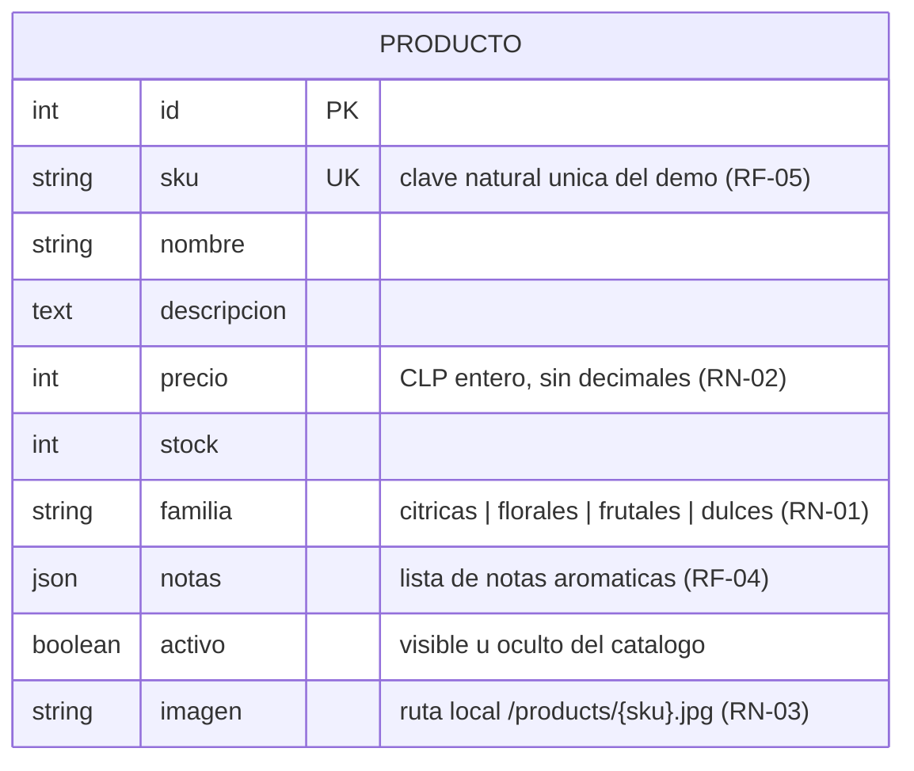
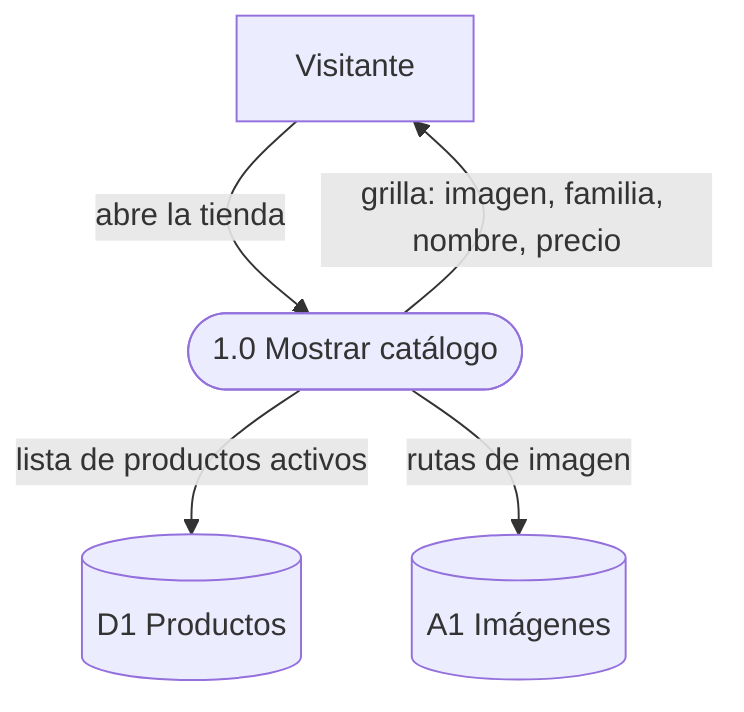

# Fase 3 — Diseño del Sistema: Maura

> **Guía:** Demo Carro — ciclo de vida del software en una tienda de body splash (segunda guía de la serie, hermana de demo-cine)
> **Fase del ciclo de vida:** 3. Diseño
> **Insumo obligatorio:** `02_requerimientos.md` — cada elemento de este diseño **nace de un requerimiento** (RF/RNF/RN/HU) y la trazabilidad está en §5.
> **Alcance de la fase:** se diseña QUÉ estructuras, procesos y pantallas resuelven los requerimientos, **aún sin elegir tecnología** (framework, base de datos específica, etc. — eso es la fase 4).
> **Fecha:** 2026-09-28

> **Nota técnica:** los diagramas están escritos en **Mermaid** para renderizarlos
> en cualquier visor (GitHub incluido). Alumnos: un diagrama que no se puede
> redibujar es un diagrama muerto.

---

## 1. Qué diseña este documento

| Sección | Diseña | Responde a |
|---|---|---|
| §2 | Los **datos** (modelo relacional + diccionario) | RF-02, RF-04, RF-05, RN-01, RN-02, RN-03, RNF-04 |
| §3 | Los **procesos** (diagrama de contexto + DFD) | HU-01…HU-04, procesos de `02_requerimientos.md` §9 |
| §4 | La **interfaz** (3 pantallas, wireframes) | RF-01…RF-04, RNF-01, C3 (celular primero) |

Se diseña QUÉ: la tecnología con la que se construye — y las alternativas
descartadas — se decide y documenta en la fase 4 (`04_arquitectura/`, con ADRs).

---

## 2. Diseño de datos

### 2.1 Diagrama entidad-relación



**Lectura del diagrama:** en esta etapa hay **una sola entidad**: PRODUCTO.
Las cuentas de clientas y los pedidos llegan en las etapas 2 y 3, y se
conectarán a PRODUCTO por relaciones nuevas (un pedido elige productos; una
clienta hace pedidos). Diseñar hoy solo lo que esta etapa necesita evita
inventar tablas que todavía nadie pide — pero los campos clave (`id`, `sku`,
`activo`) ya se eligen pensando en ese futuro cercano.

### 2.2 Diccionario de datos

**Entidad PRODUCTO** (soporta RF-02, RF-04, RF-05, RN-01, RN-02, RN-03)

| Atributo | Tipo | Longitud | Obligatorio | Restricción / origen |
|---|---|---|---|---|
| id | Entero | — | Sí | Identificador (clave primaria) |
| sku | Texto | 20 | Sí | **Único**; clave natural estable del catálogo demo: la siembra idempotente actualiza por sku sin duplicar (RF-05) |
| nombre | Texto | 120 | Sí | No vacío; se muestra en tarjeta y ficha (RF-02, RF-04) |
| descripcion | Texto largo | 1000 | Sí | Texto libre, solo se muestra en la ficha (RF-04) |
| precio | Entero | — | Sí | CLP **sin decimales**, dentro de $6.990–$12.990 en el catálogo demo (RN-02) |
| stock | Entero | — | Sí | Unidades disponibles; 0 → "Agotado" (RF-04, CS2) |
| familia | Lista cerrada | 20 | Sí | Uno de `citricas`, `florales`, `frutales`, `dulces` — sin acentos en el intercambio de datos (RN-01) |
| notas | Lista de textos | — | Sí | Notas aromáticas como lista (p. ej. "rosa", "geranio", "litchi"), mostradas como fichas individuales (RF-04) |
| activo | Sí/No | — | Sí | Un producto inactivo no aparece en catálogo ni ficha: se oculta sin borrarlo (futura etapa 4) |
| imagen | Texto | 200 | Sí | Ruta local `/products/{sku}.jpg`; la foto vive como archivo del proyecto, no como dato (RN-03) |

### 2.3 Decisiones de diseño de datos (y por qué)

1. **El precio es un entero en pesos, sin decimales.** El peso chileno no usa
   centavos en la práctica diaria; guardar decimales invita a errores de
   redondeo que en plata se pagan. El formato con punto de miles
   ("$7.990") es un asunto de **presentación**, no del dato.
2. **La familia viaja sin acentos y se muestra con acento.** El sistema guarda
   y filtra por `citricas` (sin tilde); la pantalla muestra "Cítricas". Razón:
   el filtro de familia viaja en la **dirección** de la página del catálogo
   (una página por familia se puede guardar, compartir y recargar), y las
   direcciones con acentos y signos exóticos se corrompen fácil. Se guarda el
   valor limpio y la pantalla traduce.
3. **Las notas aromáticas son una lista, no un párrafo.** La ficha las muestra
   como fichas sueltas una al lado de la otra ("rosa" · "geranio" · "litchi").
   Si fueran texto plano, la pantalla tendría que adivinar dónde termina una
   nota y empieza la siguiente.
4. **La imagen NO es un dato del catálogo: es un archivo y una ruta.** La tabla
   guarda `/products/{sku}.jpg` — dónde encontrar la foto — y la foto vive como
   archivo del propio proyecto. Una foto en la base de datos la inflaría sin
   necesidad: las fotos no se filtran ni se ordenan, solo se muestran. Además,
   depender de fotos hospedadas en servicios externos rompería la tienda si el
   servicio cambia o cae (RN-03).
5. **`activo` permite ocultar sin borrar.** Desactivar un producto lo saca del
   catálogo sin destruir su historial — cuando lleguen pedidos (etapa 3), un
   pedido viejo no puede quedar apuntando a un producto borrado. Ocultar es
   reversible; borrar no.
6. **`sku` único desde el día uno.** Es la llave natural estable del catálogo
   demo: la siembra idempotente (RF-05) la usa para decidir "¿creo o actualizo?"
   sin duplicar jamás, y los archivos de imagen se nombran por sku
   (`/products/citricas-01.jpg`), así producto y foto quedan emparejados por
   construcción.

> **Pregunta para la clase:** ¿por qué no usar el `id` (número correlativo)
> como llave de la siembra en lugar del sku? (pista: qué pasa con los números
> si alguien borra filas de una tabla copiada a otra máquina). Esa es la
> diferencia entre una llave técnica y una llave de negocio.

---

## 3. Diseño de procesos (DFD)

### 3.1 Diagrama de contexto

El sistema como un único proceso, con sus entidades externas:


### 3.2 Almacenes de datos

| # | Almacén | Contenido | Equivale a |
|---|---|---|---|
| D1 | Productos | El catálogo (12 aromas demo) | Entidad PRODUCTO |
| A1 | Imágenes de producto | Fotos guardadas como archivos del proyecto (§2.3.4) | — |

### 3.3 DFD — Proceso 1.0: Explorar el catálogo (HU-01)



**Reglas del proceso:** solo productos **activos** aparecen (§2.3.5); el
orden de la grilla es estable para que la tienda no "baile" entre recargas;
no se exige cuenta para nada de esto (RNF-03).

### 3.4 DFD — Proceso 2.0: Filtrar el catálogo (HU-02)


**Reglas del proceso:** una familia fuera de la lista cerrada se rechaza con
un mensaje claro (RN-01); precios fuera de rango también (RN-02); si el
resultado es cero, la pantalla lo explica y ofrece limpiar los filtros
(HU-02). El estado del filtro queda escrito en la dirección de la página:
recargar o compartir la dirección mantiene el mismo resultado.

### 3.5 DFD — Proceso 3.0: Ver la ficha de un producto (HU-03)


**Reglas del proceso:** la ficha muestra **siempre** notas y disponibilidad
(CS2); un producto inactivo se trata como inexistente (§2.3.5); el regreso al
catálogo conserva los filtros que el visitante tenía.

### 3.6 DFD — Proceso 4.0 (interno): Sembrar datos demo (HU-04)


**Reglas del proceso:** la siembra **nunca borra** el catálogo para
rellenarlo: por cada producto decide crear o actualizar según el sku (RF-05,
§2.3.6). Re-ejecutarla es seguro y deja el catálogo idéntico (CS3, RNF-04) —
incluida la restauración de los valores demo de precio y stock tras una
prueba que los haya movido.

---

## 4. Diseño de interfaz (pantallas)

### 4.1 Lineamientos generales

- **Tema visual:** fresco y luminoso — mucho blanco, pasteles cítricos,
  tipografía redondeada. El mensaje visual del producto es "esta tienda huele
  a frescura". (Deliberadamente distinto del tema oscuro tipo sala de cine
  del proyecto hermano demo-cine: el diseño sirve a la marca, no al revés.)
- **Celular primero** (C3, RNF-01): la grilla se reordena de 4 a 2 y a 1
  columna según el ancho; los filtros se acomodan en varias líneas; ningún
  control exige pantalla ancha y todo lo táctil mide al menos 44 px.
- **La dirección de la página es estado:** los filtros elegidos quedan escritos
  en la dirección (etapa del proceso 2.0) — recargar, retroceder o compartir
  la dirección mantiene lo que el visitante estaba viendo.
- **Estados obligatorios por pantalla:** cada pantalla declara sus estados de
  carga, error y vacío. Ninguna pantalla se diseña solo para el caso feliz.

### 4.2 Pantalla 1 — Inicio (landing)

**Origen:** RF-01, HU-01 (con la página del catálogo) · **Estados:** normal
(contenido de marca estático; sin datos que cargar, no tiene estados de
carga ni error propios)

```
┌────────────────────────────────────────────────────────┐
│  Maura · Body Splash              Inicio    Catálogo   │
├────────────────────────────────────────────────────────┤
│                                                        │
│                    Maura · Body Splash                 │
│               Frescura que te acompaña                 │
│                                                        │
│     Soy Maura. Hago body splash a mano, en lotes       │
│     pequeños, con esencias frescas que elijo una       │
│     por una. Esta tienda nace para que encuentres      │
│     tu aroma desde cualquier parte de Chile, sin       │
│     intermediarios.                                    │
│                                                        │
│                  ( Ver catálogo )                      │
│                                                        │
├────────────────────────────────────────────────────────┤
│  Nuestras familias                                     │
│  ┌──────────┐ ┌──────────┐ ┌──────────┐ ┌──────────┐  │
│  │ Cítricas │ │ Florales │ │ Frutales │ │  Dulces  │  │
│  │ Frescas  │ │ Suaves y │ │ Dulces y │ │ Cálidas  │  │
│  │ y chis-  │ │ románti- │ │ jugosas, │ │ y recon- │  │
│  │ peantes, │ │ cas, de  │ │ puro     │ │ fortantes│  │
│  │ para     │ │ flor a   │ │ verano.  │ │ , con    │  │
│  │ despertar│ │ flor.    │ │          │ │ alma de  │  │
│  │ Ver aromas→ Ver aromas→ Ver aromas→  repostería.  │  │
│  │                                    Ver aromas→   │  │
│  └──────────┘ └──────────┘ └──────────┘ └──────────┘  │
├────────────────────────────────────────────────────────┤
│  Maura · Body Splash — proyecto educativo · 2026       │
└────────────────────────────────────────────────────────┘
```

- La acción "Ver aromas →" de cada familia lleva al catálogo **ya filtrado**
  por esa familia (puerta lateral al proceso 2.0, HU-02).
- La frase de la marca ("Frescura que te acompaña") es el texto más grande de
  toda la tienda: la avenida de entrada.

### 4.3 Pantalla 2 — Catálogo con filtros

**Origen:** RF-02, RF-03, HU-01, HU-02 · **Estados:** carga (esqueletos de
tarjetas mientras llegan los datos) / error (mensaje con botón Reintentar) /
vacío con filtros ("No encontramos aromas con esos filtros" + Limpiar
filtros) / vacío sin datos ("Aún no hay aromas por aquí" + pista de siembra)

```
┌────────────────────────────────────────────────────────┐
│  Maura · Body Splash              Inicio    Catálogo   │
├────────────────────────────────────────────────────────┤
│  ┌──────────────────────────────────────────────────┐  │
│  │ Familia:                                          │  │
│  │  (Todas) (Cítricas) (Florales) (Frutales) (Dulces)│  │
│  │ Precio:   [$ mínimo]  [$ máximo]   (Filtrar)      │  │
│  │           Limpiar filtros                         │  │
│  └──────────────────────────────────────────────────┘  │
│                                                        │
│  Nuestros aromas — 12 aromas                           │
│  ┌─────────┐  ┌─────────┐  ┌─────────┐  ┌─────────┐   │
│  │ [foto]  │  │ [foto]  │  │ [foto]  │  │ [foto]  │    │
│  │ Cítricas│  │ Cítricas│  │ Florales│  │ Dulces  │    │
│  │ Brisa de│  │ Limón y │  │ Jazmín  │  │ Vainilla│    │
│  │ Naranja │  │ Albahaca│  │ de Tarde│  │ y Sándalo│   │
│  │ $7.990  │  │ $6.990  │  │ $9.990  │  │ $12.990 │    │
│  └─────────┘  └─────────┘  └─────────┘  └─────────┘   │
│          … (8 tarjetas más: 12 en total)               │
└────────────────────────────────────────────────────────┘
```

- Cada tarjeta es un enlace a la ficha; la foto es cuadrada para que la grilla
  nunca se deforme, y el nombre se corta a dos líneas máximo.
- El contador ("12 aromas" / "1 aroma" / "0 aromas") dice siempre cuánto hay
  a la vista — filtrar a cero tiene que ser evidente, no un misterio.
- El estado de carga muestra tarjetas esqueleto del mismo tamaño que las
  reales: la página no "salta" cuando llegan los datos.
- El estado vacío se distingue por causa: con filtros activos se ofrece
  limpiarlos; sin filtros se sugiere ejecutar la siembra (proceso 4.0).

### 4.4 Pantalla 3 — Ficha de producto

**Origen:** RF-04, HU-03 · **Estados:** carga (esqueleto de imagen + líneas) /
error (mensaje con botón Reintentar) / no encontrado ("Producto no
encontrado" + Volver al catálogo, distinto del error de carga)

```
┌────────────────────────────────────────────────────────┐
│  ← Volver al catálogo                                  │
│                                                        │
│  ┌──────────────┐   [Florales] [¡Últimas 2 unidades!] │
│  │              │                                      │
│  │    [foto]    │   Rosa de Río                        │
│  │  (cuadrada,  │   $10.990                            │
│  │   grande)    │                                      │
│  │              │   Rosa con geranio y un guiño de     │
│  │              │   litchi. Floral con cuerpo, para    │
│  └──────────────┘   no pasar inadvertida.              │
│                                                        │
│                     Notas aromáticas                   │
│                  (rosa) (geranio) (litchi)             │
│                                                        │
│                     2 unidades disponibles             │
└────────────────────────────────────────────────────────┘
```

- Disponibilidad en tres formas: normal ("N unidades disponibles"), última
  ("¡Últimas N unidades!") y agotada ("Agotado") — el dato de stock (CS2)
  traducido a lenguaje de clienta.
- Las notas aromáticas se muestran como fichas sueltas (§2.3.3), una al lado
  de la otra.
- En celular las dos columnas se apilan: primero la foto, luego la
  información; nada se pierde.

---

## 5. Trazabilidad: requerimiento → diseño

| Requerimiento | Dónde se resuelve en este diseño |
|---|---|
| RF-01 (landing con identidad de marca) | §4.1 lineamientos · §4.2 pantalla 1 |
| RF-02 (catálogo en grilla) | §2.1/§2.2 PRODUCTO · §3.3 proceso 1.0 · §4.3 pantalla 2 |
| RF-03 (filtros por familia y precio) | §2.2 dominio de `familia` y `precio` · §3.4 proceso 2.0 · §4.3 barra de filtros + contador |
| RF-04 (ficha completa con notas y stock) | §2.2 `notas`, `stock`, `descripcion` · §3.5 proceso 3.0 · §4.4 pantalla 3 (estados de disponibilidad) |
| RF-05 (siembra idempotente) | §2.2 `sku` único · §2.3.6 decisión sku · §3.6 proceso 4.0 |
| RN-01 (familia en lista cerrada sin acentos) | §2.2 dominio de `familia` · §2.3.2 decisión slugs · §3.4 validación |
| RN-02 (precio entero CLP) | §2.2 dominio de `precio` · §2.3.1 decisión entero |
| RN-03 (imagen local como ruta) | §2.2 `imagen` · §2.3.4 decisión ruta · almacén A1 |
| RN-04 (catálogo de solo lectura) | §3.3/§3.4/§3.5 procesos sin escritura; la única escritura es el proceso interno 4.0 |
| RNF-01 (usable en el celular) | §4.1 lineamientos + grillas reordenables de §4.3 |
| RNF-04 (datos reproducibles) | §3.6 proceso 4.0 (crear-o-actualizar por sku) |
| C3 (celular y notebook) | §4.1 · §4.3 · §4.4 (apilado en celular) |

---

## 6. Aprobación de la fase

| Rol | Nombre | Decisión | Fecha |
|---|---|---|---|
| Diseñador / Analista | ______________ | ☐ Aprobado ☐ Con observaciones | 2026-09-__ |
| Cliente (valida pantallas y flujos) | Maura — Maura · Body Splash | ☐ Aprobado ☐ Con observaciones | 2026-09-__ |

> **Nota para la clase:** con este documento el QUÉ y el CÓMO-lógico quedan
> cerrados: datos, procesos y pantallas. La fase 4 (`04_arquitectura/`) elige
> la tecnología y registra las decisiones como ADRs: tienda dividida en dos
> piezas (una que se ve, una que sirve datos), proyecto único con ambas
> piezas, tipos estrictos en ambas puntas, y el contrato del intercambio de
> datos escrito antes del código. El diseño no cambia; la arquitectura es lo
> que cambia sin tocar el diseño.
