# Fase 3 — Diseño del Sistema: Maura

> **Guía:** Demo Carro — ciclo de vida del software en una tienda de body splash (segunda guía de la serie, hermana de demo-cine)
> **Fase del ciclo de vida:** 3. Diseño
> **Insumo obligatorio:** `02_requerimientos.md` — cada elemento de este diseño **nace de un requerimiento** (RF/RNF/RN/HU) y la trazabilidad está en §5.
> **Alcance de la fase:** se diseña QUÉ estructuras, procesos y pantallas resuelven los requerimientos, **aún sin elegir tecnología** (framework, base de datos específica, etc. — eso es la fase 4).
> **Fecha:** 2026-09-28

> **Nota técnica:** los diagramas están escritos en **Mermaid** para renderizarlos
> en cualquier visor (GitHub incluido). Alumnos: un diagrama que no se puede
> redibujar es un diagrama muerto.

---

## 1. Qué diseña este documento

| Sección | Diseña | Responde a |
|---|---|---|
| §2 | Los **datos** (modelo relacional + diccionario) | RF-02, RF-04, RF-05, RF-06, RF-08, RF-12, RF-17, RF-18, RF-19, RN-01, RN-02, RN-03, RN-05..RN-15, RNF-04 (etapa 4: sin entidades nuevas) |
| §3 | Los **procesos** (diagrama de contexto + DFD) | HU-01…HU-13, procesos de `02_requerimientos.md` §9 |
| §4 | La **interfaz** (14 pantallas, wireframes) | RF-01…RF-04, RF-06…RF-24, RNF-01, C3 (celular primero) |

Se diseña QUÉ: la tecnología con la que se construye — y las alternativas
descartadas — se decide y documenta en la fase 4 (`04_arquitectura/`, con ADRs).

---

## 2. Diseño de datos

### 2.1 Diagrama entidad-relación

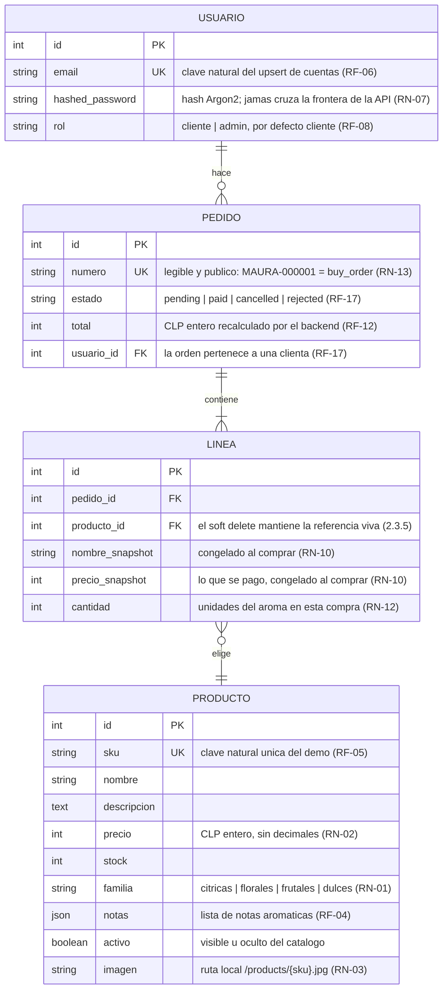

**Lectura del diagrama:** la etapa 1 tenía una sola entidad (PRODUCTO); la
etapa 2 sumó **USUARIO**, todavía sin relaciones entre ambas — nada del carro
vive en la base de datos: el carro es del navegador (almacén A2, §3.2). La
etapa 3 suma **PEDIDO** y **LÍNEA**, y con ellas llegan las primeras
relaciones del sistema: una clienta hace pedidos, un pedido contiene líneas y
cada línea elige un producto — USUARIO y PRODUCTO quedan conectados al fin.
El carro sigue sin tocar la base de datos: lo que se guarda acá es la compra
ya confirmada, con su nombre y precio congelados (RN-10). Diseñar solo lo que
cada etapa necesita evitó inventar estas tablas antes de que el pago
existiera — y los campos clave (`id`, `sku`, `activo`, `email`) ya se habían
elegido pensando en este momento.

### 2.2 Diccionario de datos

**Entidad PRODUCTO** (soporta RF-02, RF-04, RF-05, RN-01, RN-02, RN-03)

| Atributo | Tipo | Longitud | Obligatorio | Restricción / origen |
|---|---|---|---|---|
| id | Entero | — | Sí | Identificador (clave primaria) |
| sku | Texto | 20 | Sí | **Único**; clave natural estable del catálogo demo: la siembra idempotente actualiza por sku sin duplicar (RF-05) |
| nombre | Texto | 120 | Sí | No vacío; se muestra en tarjeta y ficha (RF-02, RF-04) |
| descripcion | Texto largo | 1000 | Sí | Texto libre, solo se muestra en la ficha (RF-04) |
| precio | Entero | — | Sí | CLP **sin decimales**, dentro de $6.990–$12.990 en el catálogo demo (RN-02) |
| stock | Entero | — | Sí | Unidades disponibles; 0 → "Agotado" (RF-04, CS2) |
| familia | Lista cerrada | 20 | Sí | Uno de `citricas`, `florales`, `frutales`, `dulces` — sin acentos en el intercambio de datos (RN-01) |
| notas | Lista de textos | — | Sí | Notas aromáticas como lista (p. ej. "rosa", "geranio", "litchi"), mostradas como fichas individuales (RF-04) |
| activo | Sí/No | — | Sí | Un producto inactivo no aparece en catálogo ni ficha: se oculta sin borrarlo (futura etapa 4) |
| imagen | Texto | 200 | Sí | Ruta local `/products/{sku}.jpg`; la foto vive como archivo del proyecto, no como dato (RN-03) |

**Entidad USUARIO** (soporta RF-06, RF-07, RF-08, RN-05, RN-06, RN-07)

| Atributo | Tipo | Longitud | Obligatorio | Restricción / origen |
|---|---|---|---|---|
| id | Entero | — | Sí | Identificador (clave primaria) |
| email | Texto | 255 | Sí | **Único**, con índice de búsqueda; clave natural de las cuentas: la siembra de credenciales demo de la etapa 2 actualiza por email sin duplicar, igual que el catálogo por sku (RF-06, D-23/D-24) |
| hashed_password | Texto | 255 | Sí | Hash de la contraseña con Argon2 (prefijo reconocible `$argon2id$…`); **jamás cruza la frontera de la API**: ninguna respuesta del sistema lo incluye (RN-07, RNF-05) |
| rol | Lista cerrada | — | Sí | Uno de `cliente` o `admin`; por defecto `cliente` al registrarse; el rol viaja en la sesión desde el primer inicio (RF-08) |

**Entidad PEDIDO** (soporta RF-12, RF-13, RF-15, RF-17, RN-11, RN-13)

| Atributo | Tipo | Longitud | Obligatorio | Restricción / origen |
|---|---|---|---|---|
| id | Entero | — | Sí | Identificador (clave primaria); interno: no se muestra ni viaja a Webpay (RN-13) |
| numero | Texto | 26 | Sí | **Único**; legible y público (`MAURA-000001`): la cara del pedido que la clienta ve en voucher e historial, y la referencia de la compra que viaja a Webpay como `buy_order` (límite 26 caracteres de la pasarela) — jamás el id interno (RN-13, D-37) |
| estado | Lista cerrada | — | Sí | Uno de `pending`, `paid`, `cancelled`, `rejected`; nace `pending` al iniciar el pago (D-34) y el historial lo muestra siempre con su valor real — `pending` visible como "en curso" (RF-17, RN-11) |
| total | Entero | — | Sí | CLP **sin decimales** (RN-02); **recalculado por el backend** contra el catálogo vigente al crear la orden — jamás un valor enviado por el cliente (RF-12, CART-03) |
| fecha | Fecha-hora | — | Sí | Momento en que la orden nace al iniciar el pago (D-34); viaja en `OrdenLista` del contrato y se muestra en voucher e historial (RF-17) |
| usuario_id | Entero (FK) | — | Sí | FK a USUARIO: la orden pertenece a la clienta que la pagó; el historial lista solo las órdenes de la dueña del token (RF-17) |

**Entidad LÍNEA** (soporta RN-10; el corazón congelado del pedido)

| Atributo | Tipo | Longitud | Obligatorio | Restricción / origen |
|---|---|---|---|---|
| id | Entero | — | Sí | Identificador (clave primaria) |
| pedido_id | Entero (FK) | — | Sí | FK a PEDIDO: la línea pertenece a un pedido (PEDIDO contiene LÍNEA, §2.1) |
| producto_id | Entero (FK) | — | Sí | FK a PRODUCTO; el soft delete (§2.3.5) mantiene la referencia viva aunque el producto se oculte después — el pedido viejo no queda apuntando a un producto borrado |
| nombre_snapshot | Texto | 120 | Sí | El nombre del aroma **congelado al momento de comprar**: el pedido muestra siempre lo que se compró, aunque el catálogo cambie después (RN-10, D-36) |
| precio_snapshot | Entero | — | Sí | El precio **pagado**, congelado al comprar: el histórico de la compra, no el precio vigente del catálogo (RN-10, D-36) |
| cantidad | Entero | — | Sí | Unidades compradas de ese aroma; es el insumo del descuento atómico de stock al aprobar el pago (RN-12) |

### 2.3 Decisiones de diseño de datos (y por qué)

1. **El precio es un entero en pesos, sin decimales.** El peso chileno no usa
   centavos en la práctica diaria; guardar decimales invita a errores de
   redondeo que en plata se pagan. El formato con punto de miles
   ("$7.990") es un asunto de **presentación**, no del dato.
2. **La familia viaja sin acentos y se muestra con acento.** El sistema guarda
   y filtra por `citricas` (sin tilde); la pantalla muestra "Cítricas". Razón:
   el filtro de familia viaja en la **dirección** de la página del catálogo
   (una página por familia se puede guardar, compartir y recargar), y las
   direcciones con acentos y signos exóticos se corrompen fácil. Se guarda el
   valor limpio y la pantalla traduce.
3. **Las notas aromáticas son una lista, no un párrafo.** La ficha las muestra
   como fichas sueltas una al lado de la otra ("rosa" · "geranio" · "litchi").
   Si fueran texto plano, la pantalla tendría que adivinar dónde termina una
   nota y empieza la siguiente.
4. **La imagen NO es un dato del catálogo: es un archivo y una ruta.** La tabla
   guarda `/products/{sku}.jpg` — dónde encontrar la foto — y la foto vive como
   archivo del propio proyecto. Una foto en la base de datos la inflaría sin
   necesidad: las fotos no se filtran ni se ordenan, solo se muestran. Además,
   depender de fotos hospedadas en servicios externos rompería la tienda si el
   servicio cambia o cae (RN-03).
5. **`activo` permite ocultar sin borrar.** Desactivar un producto lo saca del
   catálogo sin destruir su historial — cuando lleguen pedidos (etapa 3), un
   pedido viejo no puede quedar apuntando a un producto borrado. Ocultar es
   reversible; borrar no.
6. **`sku` único desde el día uno.** Es la llave natural estable del catálogo
   demo: la siembra idempotente (RF-05) la usa para decidir "¿creo o actualizo?"
   sin duplicar jamás, y los archivos de imagen se nombran por sku
   (`/products/citricas-01.jpg`), así producto y foto quedan emparejados por
   construcción.
7. **El email es la llave de las cuentas (y de la siembra de credenciales).**
   Misma lección del sku aplicada a USUARIO: el email es una llave de negocio
   — único, estable y significativo para la clienta — mientras el `id` es una
   llave técnica. La siembra de las cuentas demo (la dueña y una clienta de
   prueba) decide "¿creo o actualizo?" por email, y re-ejecutarla restaura las
   credenciales demo sin duplicar usuarios (D-23/D-24).
8. **La contraseña se guarda solo como hash — y el hash jamás sale del
   sistema.** El proceso 5.0 recibe la contraseña una vez, la transforma con
   Argon2 (un hash lento a propósito: adivinarlo por fuerza bruta es caro) y
   guarda solo el resultado. Ninguna respuesta de la API incluye el hash
   (RN-07): filtrarlo sería regalar el equivalente de la contraseña de cada
   clienta.
9. **El carro guarda solo identificadores y cantidades; el precio se consulta
   siempre al catálogo.** El carro vive en el navegador (almacén A2) sin
   precios ni nombres: la pantalla del carro hidrata cada línea contra el
   catálogo vigente (D-27, RN-08). Un precio guardado sería un precio viejo
   esperando el momento de engañar a la clienta cuando Maura actualice el
   catálogo — y la lección prepara la etapa 3, donde el backend recalculará el
   pedido completo sin confiar en lo que el navegador mande.
10. **Las cantidades visibles se tapan al stock.** La ficha deshabilita
   "Agregar al carro" cuando no hay (o no queda) stock, y el carro ajusta la
   cantidad guardada si el stock bajó mientras el aroma esperaba (D-30,
   RN-09). Es una barrera de honestidad en pantalla, no la muralla: la
   validación definitiva la hará el backend al crear la orden (etapa 3).
11. **La orden nace al iniciar el pago — no al aprobarlo.** Presionar "Pagar
   con Webpay" crea la orden en estado `pending` con sus líneas ya congeladas,
   y solo entonces se crea la transacción en la pasarela. ¿Por qué antes del
   pago y no después? Porque la vuelta de Webpay necesita aterrizar en una
   orden existente que actualizar (la referencia de compra ya viajó en la
   ida), y porque el historial puede ser honesto con las compras que saltaron
   a pagar y no volvieron ("en curso", RN-11). *(D-34; su capa técnica es
   ADR-013.)*
12. **El stock se valida al crear la orden y se descuenta solo al aprobar el
   pago, de forma atómica.** Crear la orden no toca el stock: solo comprueba
   que alcance — la segunda barrera contra la sobreventa, detrás del tope en
   pantalla de RN-09. El descuento real ocurre cuando el pago aprueba, con la
   condición (`stock >= cantidad`) viviendo **dentro** de la propia sentencia
   de descuento: dos compras que disputan el último stock se resuelven en la
   base de datos, no en la buena suerte, y la que llega tarde queda rechazada
   con honestidad (RN-12). *(D-35; su capa técnica es ADR-013.)*
13. **La línea guarda un snapshot de nombre y precio — la asimetría con el
   carro es la lección.** En el carro, guardar el precio está prohibido
   (RN-08): sería un precio viejo esperando el momento de engañar. En la
   orden, guardarlo es obligatorio (RN-10): es el histórico de lo que se pagó,
   y un pedido viejo debe mostrarlo aunque el catálogo cambie después. La
   misma columna, dos verdades distintas: el carro describe una intención, la
   orden documenta un hecho. *(D-36; su capa técnica es ADR-014.)*
14. **El número de pedido es legible y público — y no es la clave primaria.**
   `MAURA-000001` es lo que la clienta ve en el voucher y el historial, y la
   referencia que viaja a Webpay como `buy_order` (tope de 26 caracteres de la
   pasarela); el `id` interno queda solo para las relaciones entre tablas.
   Identificador público y clave primaria son cosas distintas: exponer el
   correlativo interno regala información y encima topo con límites ajenos
   (RN-13). *(D-37; su capa técnica es ADR-014.)*
15. **La máquina de estados de los pedidos, documentada con dueño por
   transición.** Los cuatro estados de la etapa 3 (`pending`, `paid`,
   `cancelled`, `rejected`) no cambian; lo que la etapa 4 documenta es quién
   puede mover cada flecha: el flujo de pago posee sus transiciones y la dueña
   posee exactamente **una** manual — `PENDING→CANCELLED`, la gestión de las
   huérfanas. El backend valida cada transición pedida contra la máquina y
   rechaza la ilegal (409); `PAID` es terminal en esta versión. La escritura
   del catálogo sigue la misma lógica de dueño: la dueña (rol admin) es la
   única que escribe productos fuera de la siembra, y su toggle activo/inactivo
   **es** el soft delete ya diseñado en §2.3.5 — desactivar oculta sin borrar
   y los pedidos viejos conservan su snapshot. *(D-50; su capa técnica es
   ADR-016.)*
16. **Dos umbrales de stock distintos, con nombre cada uno.** El del panel
   ("stock bajo": 5 unidades o menos, solo productos activos, constante del
   backend — RN-14) le habla a la dueña: hay que reabastecer. El de la tienda
   ("últimas unidades": 1-3 en la ficha) le habla a la clienta: urge decidir.
   Dos conceptos con dos constantes y dos textos: usar un mismo número para
   ambos escondería que responden a preguntas distintas. *(D-53.)*
17. **El mini-RAG honesto: la muralla anti-alucinación es del servidor.** El
   catálogo activo completo (id, nombre, familia, notas y precio de cada
   aroma) viaja en el prompt del sistema de cada consulta; el modelo responde
   JSON estructurado — texto de recomendación + ids citados — y el backend
   valida cada id contra la base de datos antes de responder: el chat solo
   renderiza tarjetas que existen. Sin embeddings ni vector store: el catálogo
   real cabe entero y la recomendación nace del inventario, no de la memoria
   del modelo. *(D-56; su capa técnica es ADR-017.)*
18. **Sin API key la tienda arranca igual: degradación, no fail-fast.** A
   diferencia del `secret_key` de las sesiones (que frena el arranque si
   falta), la asesora es un servicio opcional: sin `GEMINI_API_KEY` el
   endpoint del asistente responde 503 con un mensaje amable, la burbuja
   anuncia que no está disponible y la tienda sigue 100% operativa. El
   contraste enseña cuándo un secreto es estructural y cuándo accesorio. *(D-61.)*

> **Pregunta para la clase:** ¿por qué no usar el `id` (número correlativo)
> como llave de la siembra en lugar del sku? (pista: qué pasa con los números
> si alguien borra filas de una tabla copiada a otra máquina). Esa es la
> diferencia entre una llave técnica y una llave de negocio.

> **Pregunta para la clase (etapa 2):** ¿qué ganaría la tienda guardando el
> carro en la base de datos del servidor en vez del navegador? (pista: ¿qué
> necesita un visitante para tener carro en el servidor, y en qué momento lo
> consigue?). El diseño elige el navegador: el visitante anónimo puede armar
> su carro desde el primer clic (RF-11).

> **Pregunta para la clase (etapa 3):** ¿por qué el mismo dato — un precio
> guardado — es un defecto en el carro (RN-08) y un requisito en la línea de
> la orden (RN-10)? (pista: ¿cuál de los dos describe lo que la clienta
> *quiere* comprar y cuál lo que *pagó*?). Esa es la diferencia entre una
> intención y un hecho.

> **Pregunta para la clase (etapa 4):** ¿por qué la validación de los ids que
> cita la asesora vive en el backend y no en el componente del chat? (pista:
> ¿qué tendría que hacer el equipo para corregir una validación que vive en
> cada navegador del mundo, y cuánto para corregir una que vive en un solo
> servidor?). Esa es la diferencia entre una muralla y un cartel.

> Las decisiones 7 a 10 son de diseño (el QUÉ); su capa técnica (el CÓMO) se
> decidió en la fase 4 y quedó registrada en los ADRs de la etapa: la sesión
> que persiste y dónde vive en **ADR-009**, el carro del lado del cliente y su
> hidratación contra precios vigentes en **ADR-010**, y las cuentas con rol
> sembradas por variables de entorno en **ADR-011**.

> Las decisiones 11 a 14 siguen la misma regla: son el QUÉ. Su CÓMO quedó
> registrado en los ADRs de la etapa 3 — el retorno de Webpay en **ADR-012**,
> la orden que nace al pagar y el stock que se descuenta al aprobar en
> **ADR-013**, y el snapshot de precio con el número legible en **ADR-014**.

> Las decisiones 15 a 18 siguen la misma regla: son el QUÉ de la etapa 4. Su
> CÓMO quedó registrado en los ADRs de la etapa — el panel protegido por rol
> en los dos tiers en **ADR-015**, la máquina de estados con la transición
> admin única en **ADR-016**, y el asistente mini-RAG con la API key solo en
> el backend en **ADR-017**.

---

## 3. Diseño de procesos (DFD)

### 3.1 Diagrama de contexto

El sistema como un único proceso, con sus entidades externas (la etapa 2 sumó
a la clienta identificada y a la dueña con rol de administración; la etapa 3
sumó a **Webpay**, el primer servicio externo del sistema — la ida es el
formulario de pago que redirige a la clienta hacia la pasarela y la vuelta es
el retorno del navegador con el resultado, en cuatro flujos posibles; la etapa
4 suma a **Gemini**, el segundo servicio externo — y de un tipo nuevo: mientras
Webpay se lleva la navegación de la clienta con redirecciones de ida y vuelta,
Gemini solo conversa con el backend — una consulta JSON de ida y una respuesta
JSON de vuelta, sin redirecciones: la clienta nunca sale de la tienda):

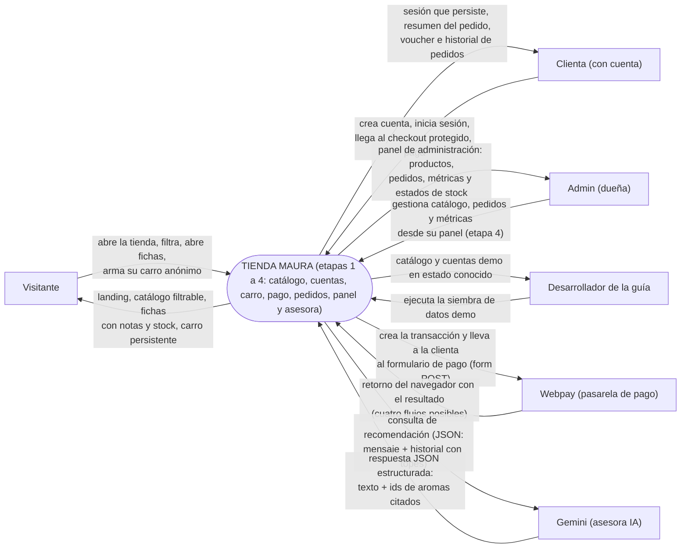

### 3.2 Almacenes de datos

| # | Almacén | Contenido | Equivale a |
|---|---|---|---|
| D1 | Productos | El catálogo (12 aromas demo) | Entidad PRODUCTO |
| D2 | Usuarios | Las cuentas: clientas y la dueña (email único, hash de contraseña, rol) | Entidad USUARIO |
| D3 | Pedidos | Las órdenes de las clientas: numero legible, estado, total y líneas con nombre y precio congelados | Entidades PEDIDO y LÍNEA |
| A1 | Imágenes de producto | Fotos guardadas como archivos del proyecto (§2.3.4) | — |
| A2 | localStorage del navegador | La sesión iniciada y el carro del cliente, guardados en el propio navegador | — |

> El almacén A2 es una **decisión de diseño, no de tecnología**: lo que aquí
> se decide es que el estado de sesión y el carro viven en el navegador del
> cliente (RNF-06) — el mecanismo concreto (localStorage) se elige y documenta
> en la fase 4. Por eso el carro no aparece en el modelo de datos de §2: la
> base de datos del sistema no guarda ningún carro en esta etapa.

> **Nota de la etapa 4 (asesora):** el historial del chat tampoco vive en la
> base de datos — ni siquiera en A2: es estado en memoria del componente de la
> burbuja. Sobrevive la navegación interna de la SPA (el layout no se
> desmonta), parte de cero tras una recarga completa y viaja completo en cada
> consulta al asistente (proceso 15.0) — cero tablas y cero sesiones de chat
> en el servidor (D-58).

### 3.3 DFD — Proceso 1.0: Explorar el catálogo (HU-01)


**Reglas del proceso:** solo productos **activos** aparecen (§2.3.5); el
orden de la grilla es estable para que la tienda no "baile" entre recargas;
no se exige cuenta para nada de esto (RNF-03).

### 3.4 DFD — Proceso 2.0: Filtrar el catálogo (HU-02)


**Reglas del proceso:** una familia fuera de la lista cerrada se rechaza con
un mensaje claro (RN-01); precios fuera de rango también (RN-02); si el
resultado es cero, la pantalla lo explica y ofrece limpiar los filtros
(HU-02). El estado del filtro queda escrito en la dirección de la página:
recargar o compartir la dirección mantiene el mismo resultado.

### 3.5 DFD — Proceso 3.0: Ver la ficha de un producto (HU-03)

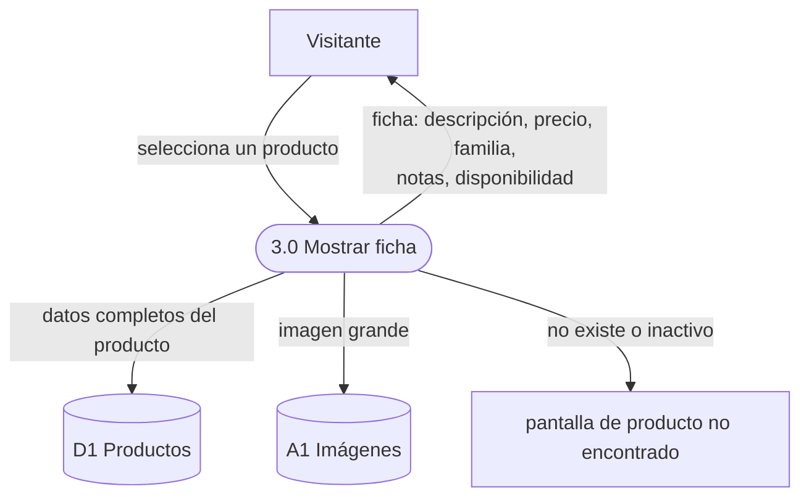

**Reglas del proceso:** la ficha muestra **siempre** notas y disponibilidad
(CS2); un producto inactivo se trata como inexistente (§2.3.5); el regreso al
catálogo conserva los filtros que el visitante tenía.

### 3.6 DFD — Proceso 4.0 (interno): Sembrar datos demo (HU-04)

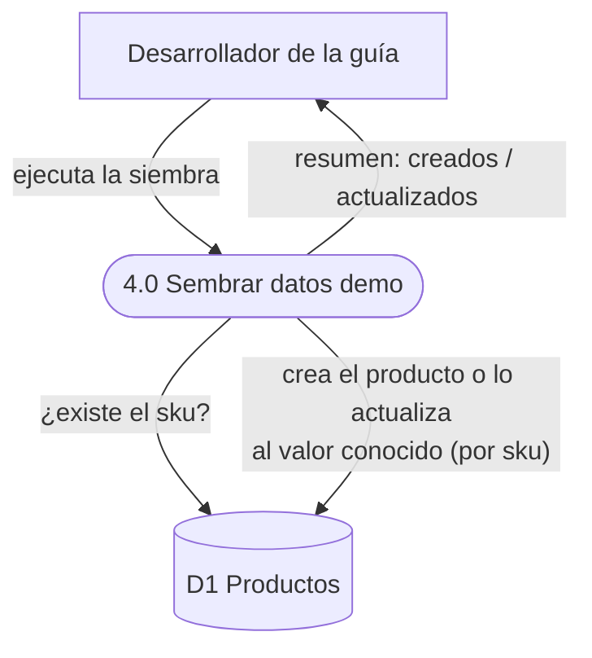

**Reglas del proceso:** la siembra **nunca borra** el catálogo para
rellenarlo: por cada producto decide crear o actualizar según el sku (RF-05,
§2.3.6). Re-ejecutarla es seguro y deja el catálogo idéntico (CS3, RNF-04) —
incluida la restauración de los valores demo de precio y stock tras una
prueba que los haya movido.

### 3.7 DFD — Proceso 5.0: Crear cuenta (HU-05)

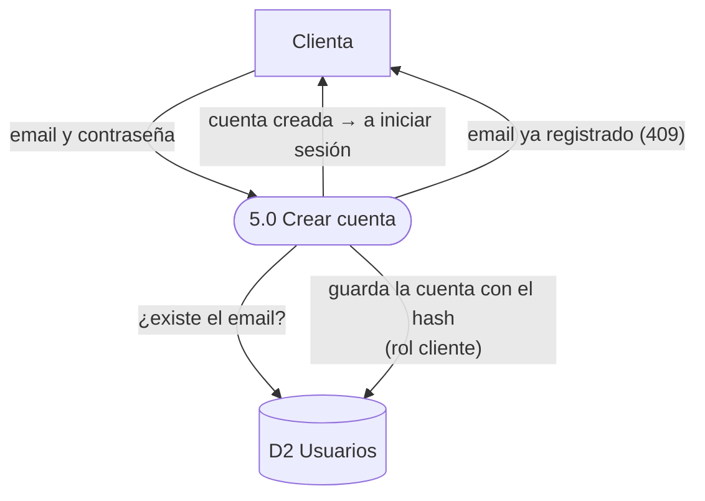

**Reglas del proceso:** la contraseña cumple el mínimo de 8 caracteres sin
composición obligatoria (RN-05); con un email ya registrado la respuesta es
clara e invita a iniciar sesión (409, RN-06); la contraseña se guarda solo
como hash (RN-07); y crear la cuenta **no** inicia sesión — la clienta pasa
al login (proceso 6.0) con un aviso de éxito.

### 3.8 DFD — Proceso 6.0: Iniciar sesión (HU-06)


**Reglas del proceso:** las credenciales incorrectas producen siempre el
mismo error genérico, sin revelar si el email existe (401, RN-06); la sesión
nace con el rol de la cuenta — desde el primer inicio, para que la
administración pueda exigirlo (RF-08) — y vence a los 7 días (D-20); vencida
la sesión, cualquier llamada protegida rechaza y la clienta vuelve a entrar;
la sesión guardada en A2 sobrevive recargas y cierres del navegador (RF-07,
RNF-06).

### 3.9 DFD — Proceso 7.0: Armar y editar el carro (HU-07)

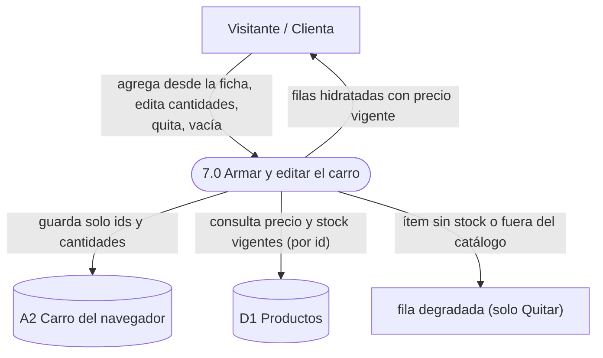

**Reglas del proceso:** el carro guarda únicamente identificadores y
cantidades — el nombre y el precio de cada línea se hidratan siempre contra
el catálogo vigente (RN-08, D-27); la cantidad mostrada se tapa al stock
vigente y el control "+" no pasa de ahí (RN-09, D-30); vaciar exige
confirmación en dos pasos; un aroma que ya no existe degrada su fila sin
romper el resto del carro.

### 3.10 DFD — Proceso 8.0: Ver checkout protegido (HU-08)

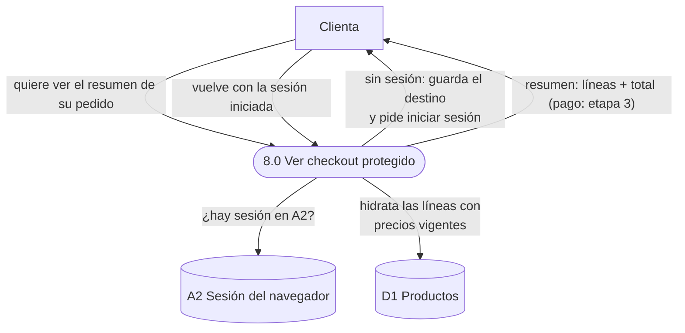

**Reglas del proceso:** la sesión iniciada es requisito para ver el resumen
(RF-09); el login recuerda el destino original y devuelve a la clienta
exactamente a donde iba (D-32); las líneas se hidratan con precios vigentes
igual que en el carro (RN-08); y la acción de pago nace deshabilitada con su
nota a la vista — el pago llega en la etapa siguiente (D-31).

### 3.11 DFD — Proceso 9.0: Iniciar el pago (HU-09)

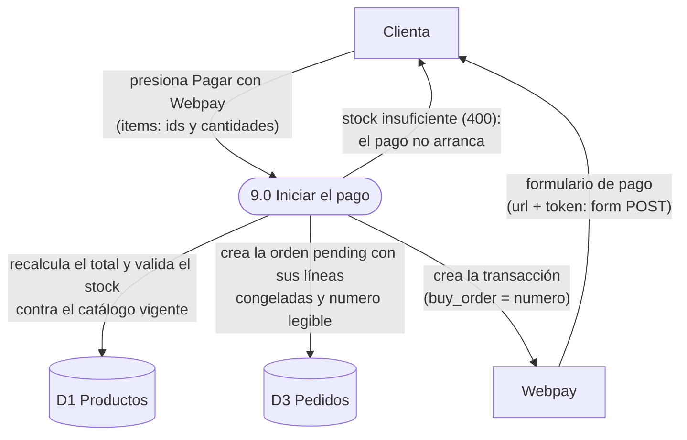

**Reglas del proceso:** la entrada trae **solo** identificadores y cantidades
— ni precios ni nombres (RN-08) — y el backend recalcula el total contra el
catálogo vigente sin confiar en nada del cliente (RF-12); crear la orden
solo **valida** el stock, no lo toca (RN-12 — el descuento llega con el pago
aprobado, proceso 10.0); la orden nace `pending` con sus líneas ya congeladas
(RN-10) y su numero legible como referencia de compra (RN-13, D-34); si el
stock no alcanza, la orden no nace y la clienta vuelve a su carro intacto.

### 3.12 DFD — Proceso 10.0: Procesar el retorno del pago (HU-10)

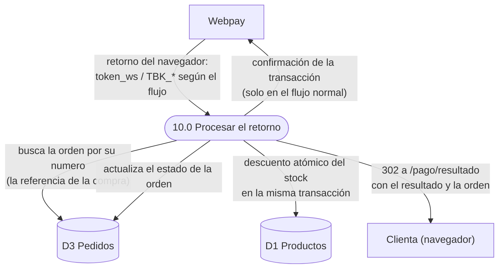

**Reglas del proceso:** el flujo se discrimina **solo por la presencia de los
parámetros** que llegan — `token_ws` solo es el flujo normal;
`TBK_ID_SESION` + `TBK_TOKEN` es la compra anulada; `TBK_ID_SESION` solo es
el timeout del formulario; los cuatro juntos son el error de formulario —
**jamás por el método HTTP** (la evidencia runtime lo demostró: hasta la
documentación oficial se equivocó con el método del anulado); la transacción
se confirma únicamente en el flujo normal; la orden pasa a `paid` solo con
`response_code == 0` **y** `status == AUTHORIZED` — ambos (RF-15); si la orden
ya está `paid`, se vuelve a mostrar sin repetir ningún efecto — refrescar no
paga dos veces; el descuento de stock lleva la condición dentro de la propia
sentencia y ocurre en la misma transacción que la transición de estado
(RN-12); la respuesta es siempre una redirección 302 hacia la ruta única de
resultado de la SPA (`/pago/resultado`), que fuerza la navegación GET del
navegador (D-41/D-42).

### 3.13 DFD — Proceso 11.0: Ver mis pedidos (HU-11)

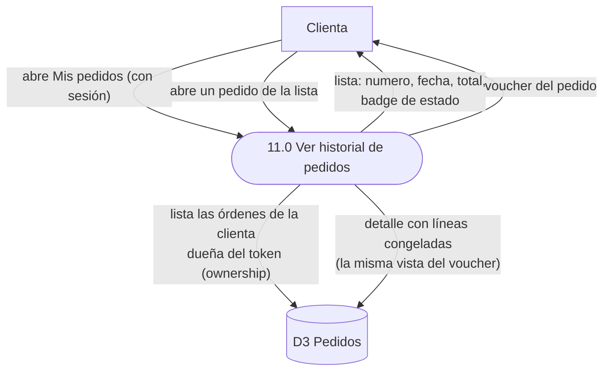

**Reglas del proceso:** la lista devuelve **todas** las órdenes de la clienta
con su estado real — las `pending` visibles como "en curso" — porque la
honestidad del estado es la regla (RN-11, D-48); el pedido de otra clienta no
existe para el sistema: responder igual para "no existe" y "no es tuyo" no
regala información; el detalle reutiliza la vista del voucher del proceso
10.0 — se construye una vez y el historial la hereda (D-43/D-46); en esta
etapa ninguna orden expira ni se cierra sola (D-49).

### 3.14 DFD — Proceso 12.0: Gestionar el catálogo (HU-12)

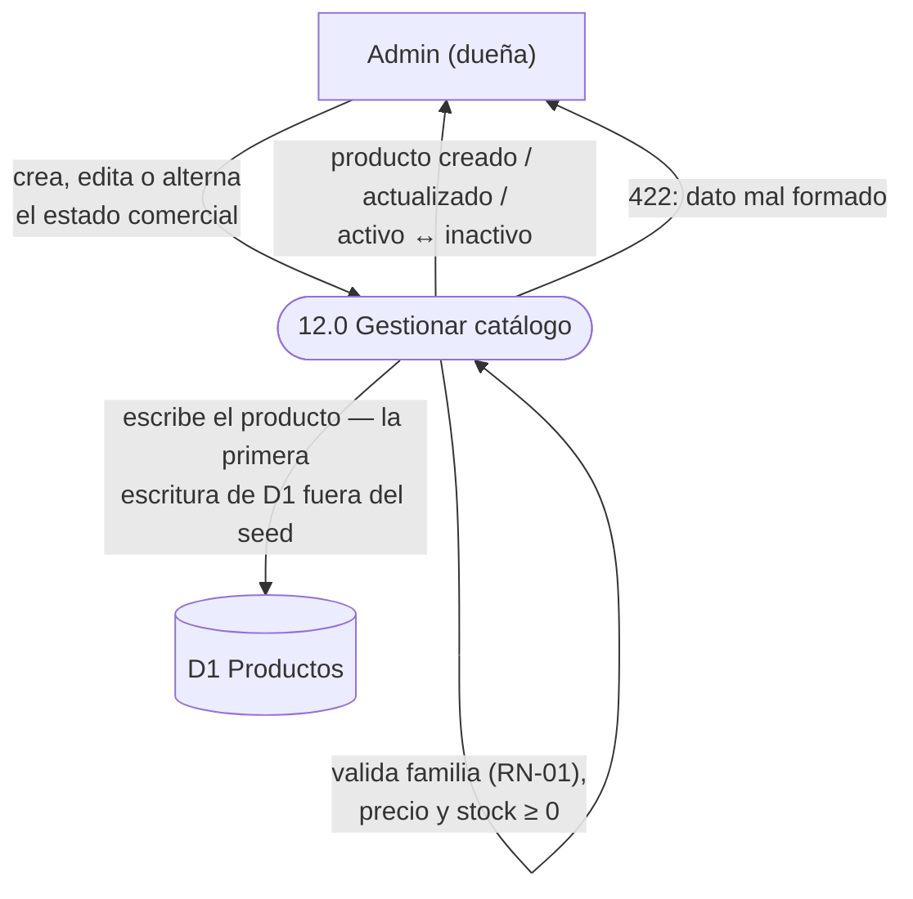

**Reglas del proceso:** la escritura del catálogo es exclusiva del rol admin
(RN-15) — la primera escritura de D1 fuera de la siembra del proceso 4.0; el
toggle activo/inactivo es el soft delete de §2.3.5: oculta sin borrar, es
reversible y no destruye historial — los pedidos viejos conservan su snapshot
(RN-10); el editor no lleva campo de estado comercial: el toggle es una
escritura propia; y el cuerpo edita solo una lista cerrada de campos (sin id):
lo que el cuerpo no puede llevar, no se puede voltear.

### 3.15 DFD — Proceso 13.0: Anular pedido huérfano (HU-12)

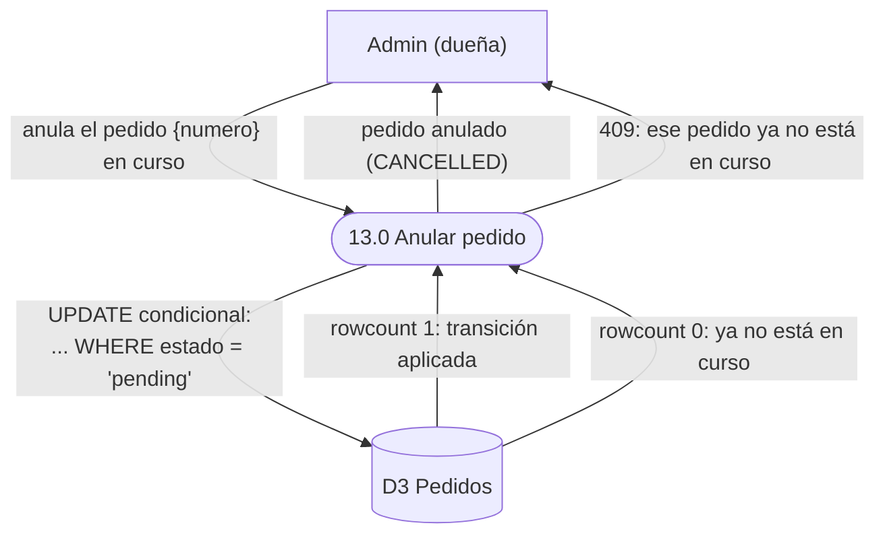

**Reglas del proceso:** espejo del descuento atómico del proceso 10.0 (RN-12):
la condición de estado vive **dentro** de la propia sentencia de
actualización — dos pestañas del panel que anulan el mismo pedido a la vez no
lo anulan dos veces; rowcount 0 → rechazo 409: la máquina de estados (RN-15)
valida en el backend, es un conflicto de estado y no un dato mal formado;
cancelar una orden en curso **no toca stock** — nunca se descontó (RN-12: el
stock solo baja al aprobar el pago); y el historial de la clienta refleja el
estado nuevo sin edición alguna (proceso 11.0).

### 3.16 DFD — Proceso 14.0: Calcular métricas (HU-12)

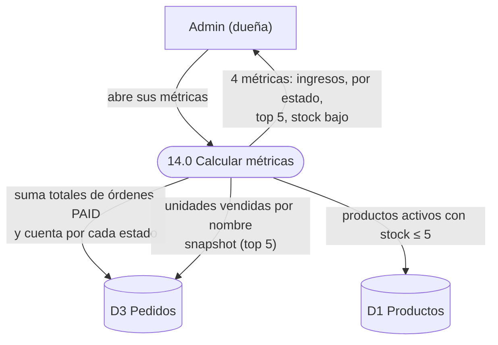

**Reglas del proceso:** agregación de **solo lectura** — el proceso jamás
escribe D1 ni D3, y todo computa desde las tablas existentes (sin entidades
nuevas); el top 5 se calcula desde las líneas snapshot de las órdenes pagadas:
el nombre es el congelado al vender, aunque el producto ya esté inactivo
(RN-10, D-54); el conteo de stock bajo cuenta solo productos **activos**
(RN-14) — un inactivo con stock bajo no vende; y con cero ventas los KPI
muestran cero explícito ($0 / 0): los números no se esconden.

### 3.17 DFD — Proceso 15.0: Conversar con la asesora (HU-13)

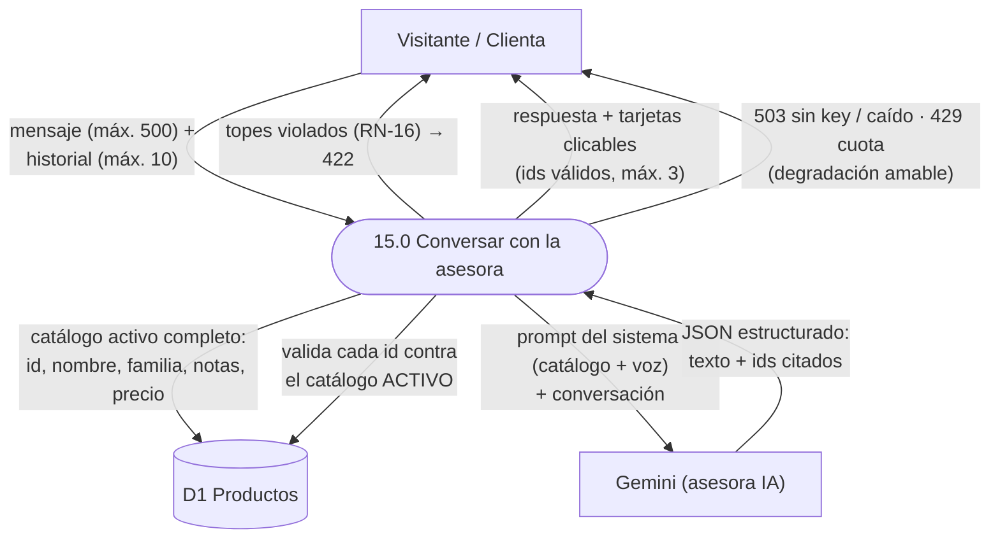

**Reglas del proceso:** los topes (RN-16) validan **antes** de llamar al
servicio externo — proteger el tier gratuito es lo primero; el prompt del
sistema lleva el catálogo activo completo (mini-RAG, D-56) y la voz de la
dueña; la validación de ids corre **después** de la respuesta, contra D1
activo: la muralla anti-alucinación es del servidor — un id alucinado o
inactivo se descarta, jamás se renderiza; sin API key o con el servicio caído
→ 503 amable, con la cuota consumida → 429 sin cifras de límites (RNF-08): la
tierra sigue 100% operativa (D-61); y el historial vive en el navegador
(D-58) — no existe sesión de chat en el servidor.

---

## 4. Diseño de interfaz (pantallas)

### 4.1 Lineamientos generales

- **Tema visual:** fresco y luminoso — mucho blanco, pasteles cítricos,
  tipografía redondeada. El mensaje visual del producto es "esta tienda huele
  a frescura". (Deliberadamente distinto del tema oscuro tipo sala de cine
  del proyecto hermano demo-cine: el diseño sirve a la marca, no al revés.)
- **Celular primero** (C3, RNF-01): la grilla se reordena de 4 a 2 y a 1
  columna según el ancho; los filtros se acomodan en varias líneas; ningún
  control exige pantalla ancha y todo lo táctil mide al menos 44 px.
- **La dirección de la página es estado:** los filtros elegidos quedan escritos
  en la dirección (etapa del proceso 2.0) — recargar, retroceder o compartir
  la dirección mantiene lo que el visitante estaba viendo.
- **Estados obligatorios por pantalla:** cada pantalla declara sus estados de
  carga, error y vacío. Ninguna pantalla se diseña solo para el caso feliz.

### 4.2 Pantalla 1 — Inicio (landing)

**Origen:** RF-01, HU-01 (con la página del catálogo) · **Estados:** normal
(contenido de marca estático; sin datos que cargar, no tiene estados de
carga ni error propios)

```
┌────────────────────────────────────────────────────────┐
│  Maura · Body Splash              Inicio    Catálogo   │
├────────────────────────────────────────────────────────┤
│                                                        │
│                    Maura · Body Splash                 │
│               Frescura que te acompaña                 │
│                                                        │
│     Soy Maura. Hago body splash a mano, en lotes       │
│     pequeños, con esencias frescas que elijo una       │
│     por una. Esta tienda nace para que encuentres      │
│     tu aroma desde cualquier parte de Chile, sin       │
│     intermediarios.                                    │
│                                                        │
│                  ( Ver catálogo )                      │
│                                                        │
├────────────────────────────────────────────────────────┤
│  Nuestras familias                                     │
│  ┌──────────┐ ┌──────────┐ ┌──────────┐ ┌──────────┐  │
│  │ Cítricas │ │ Florales │ │ Frutales │ │  Dulces  │  │
│  │ Frescas  │ │ Suaves y │ │ Dulces y │ │ Cálidas  │  │
│  │ y chis-  │ │ románti- │ │ jugosas, │ │ y recon- │  │
│  │ peantes, │ │ cas, de  │ │ puro     │ │ fortantes│  │
│  │ para     │ │ flor a   │ │ verano.  │ │ , con    │  │
│  │ despertar│ │ flor.    │ │          │ │ alma de  │  │
│  │ Ver aromas→ Ver aromas→ Ver aromas→  repostería.  │  │
│  │                                    Ver aromas→   │  │
│  └──────────┘ └──────────┘ └──────────┘ └──────────┘  │
├────────────────────────────────────────────────────────┤
│  Maura · Body Splash — proyecto educativo · 2026       │
└────────────────────────────────────────────────────────┘
```

- La acción "Ver aromas →" de cada familia lleva al catálogo **ya filtrado**
  por esa familia (puerta lateral al proceso 2.0, HU-02).
- La frase de la marca ("Frescura que te acompaña") es el texto más grande de
  toda la tienda: la avenida de entrada.

### 4.3 Pantalla 2 — Catálogo con filtros

**Origen:** RF-02, RF-03, HU-01, HU-02 · **Estados:** carga (esqueletos de
tarjetas mientras llegan los datos) / error (mensaje con botón Reintentar) /
vacío con filtros ("No encontramos aromas con esos filtros" + Limpiar
filtros) / vacío sin datos ("Aún no hay aromas por aquí" + pista de siembra)

```
┌────────────────────────────────────────────────────────┐
│  Maura · Body Splash              Inicio    Catálogo   │
├────────────────────────────────────────────────────────┤
│  ┌──────────────────────────────────────────────────┐  │
│  │ Familia:                                          │  │
│  │  (Todas) (Cítricas) (Florales) (Frutales) (Dulces)│  │
│  │ Precio:   [$ mínimo]  [$ máximo]   (Filtrar)      │  │
│  │           Limpiar filtros                         │  │
│  └──────────────────────────────────────────────────┘  │
│                                                        │
│  Nuestros aromas — 12 aromas                           │
│  ┌─────────┐  ┌─────────┐  ┌─────────┐  ┌─────────┐   │
│  │ [foto]  │  │ [foto]  │  │ [foto]  │  │ [foto]  │    │
│  │ Cítricas│  │ Cítricas│  │ Florales│  │ Dulces  │    │
│  │ Brisa de│  │ Limón y │  │ Jazmín  │  │ Vainilla│    │
│  │ Naranja │  │ Albahaca│  │ de Tarde│  │ y Sándalo│   │
│  │ $7.990  │  │ $6.990  │  │ $9.990  │  │ $12.990 │    │
│  └─────────┘  └─────────┘  └─────────┘  └─────────┘   │
│          … (8 tarjetas más: 12 en total)               │
└────────────────────────────────────────────────────────┘
```

- Cada tarjeta es un enlace a la ficha; la foto es cuadrada para que la grilla
  nunca se deforme, y el nombre se corta a dos líneas máximo.
- El contador ("12 aromas" / "1 aroma" / "0 aromas") dice siempre cuánto hay
  a la vista — filtrar a cero tiene que ser evidente, no un misterio.
- El estado de carga muestra tarjetas esqueleto del mismo tamaño que las
  reales: la página no "salta" cuando llegan los datos.
- El estado vacío se distingue por causa: con filtros activos se ofrece
  limpiarlos; sin filtros se sugiere ejecutar la siembra (proceso 4.0).

### 4.4 Pantalla 3 — Ficha de producto

**Origen:** RF-04, HU-03 · **Estados:** carga (esqueleto de imagen + líneas) /
error (mensaje con botón Reintentar) / no encontrado ("Producto no
encontrado" + Volver al catálogo, distinto del error de carga)

```
┌────────────────────────────────────────────────────────┐
│  ← Volver al catálogo                                  │
│                                                        │
│  ┌──────────────┐   [Florales] [¡Últimas 2 unidades!] │
│  │              │                                      │
│  │    [foto]    │   Rosa de Río                        │
│  │  (cuadrada,  │   $10.990                            │
│  │   grande)    │                                      │
│  │              │   Rosa con geranio y un guiño de     │
│  │              │   litchi. Floral con cuerpo, para    │
│  └──────────────┘   no pasar inadvertida.              │
│                                                        │
│                     Notas aromáticas                   │
│                  (rosa) (geranio) (litchi)             │
│                                                        │
│                     2 unidades disponibles             │
└────────────────────────────────────────────────────────┘
```

- Disponibilidad en tres formas: normal ("N unidades disponibles"), última
  ("¡Últimas N unidades!") y agotada ("Agotado") — el dato de stock (CS2)
  traducido a lenguaje de clienta.
- Las notas aromáticas se muestran como fichas sueltas (§2.3.3), una al lado
  de la otra.
- En celular las dos columnas se apilan: primero la foto, luego la
  información; nada se pierde.

**Variante de la etapa 2 — la ficha gana "Agregar al carro" (RF-10):**

```
│                     2 unidades disponibles             │
│                                                        │
│                ( Agregar al carro )                    │
```

- El botón vive **solo en la ficha** — donde ya hay stock a la vista y la
  clienta decidió qué aroma quiere; las tarjetas del catálogo siguen
  navegando a la ficha, igual que en la etapa 1 (D-29).
- Regla de deshabilitado por stock (RN-09): sin unidades disponibles el botón
  no se puede presionar (el estado "Agotado" ya lo comunica), y si el carro
  ya acumuló todo el stock del aroma, el botón se deshabilita con un aviso —
  la pantalla nunca promete más de lo que hay.
- Cada clic agrega una unidad (o incrementa la que ya estaba guardada);
  editar cantidades vive en el carro (pantalla 6).
- El feedback del clic es el contador del carro en la barra superior, que
  aumenta en vivo — sin avisos flotantes.

### 4.5 Pantalla 4 — Iniciar sesión (login)

**Origen:** RF-07, RF-09, HU-06 · **Estados:** sesión expirada (aviso ámbar
"Tu sesión expiró, ingresa de nuevo" — la sesión venció y el sistema pide
entrar de nuevo) / credenciales incorrectas (aviso rojo "Credenciales
incorrectas", sin revelar si el email existe — RN-06) / cuenta creada (aviso
esmeralda "Cuenta creada. Ingresa con tu email y contraseña.", al llegar del
registro) / enviando (botón deshabilitado mientras valida) / ya con sesión
(la pantalla no se muestra: redirige al inicio)

```
┌────────────────────────────────────────────────────────┐
│  Maura · Body Splash        Inicio   Catálogo   Carro  │
│                                              Ingresar  │
├────────────────────────────────────────────────────────┤
│        ┌────────────────────────────────────────┐      │
│        │ (aviso de contexto, solo si corresponde:│     │
│        │  sesión expirada · cuenta creada)       │     │
│        └────────────────────────────────────────┘      │
│                                                        │
│                   Iniciar sesión                       │
│        ┌────────────────────────────────────┐          │
│        │  Email                             │          │
│        │  [______________________________]  │          │
│        │  Contraseña                        │          │
│        │  [______________________________]  │          │
│        │                                    │          │
│        │  [       Iniciar sesión       ]    │          │
│        │                                    │          │
│        │  (aviso rojo: "Credenciales        │          │
│        │   incorrectas" — solo si falla)    │          │
│        └────────────────────────────────────┘          │
│                                                        │
│         ¿No tienes cuenta?  Crear cuenta               │
└────────────────────────────────────────────────────────┘
```

- Ambos campos usan etiquetas visibles (nada de textos que desaparecen al
  escribir): la clienta entra con lo que recuerda, no con pistas.
- **Retorno al destino (RF-09):** si la clienta llegó aquí porque una página
  protegida se lo pidió (p. ej. el checkout), al entrar vuelve exactamente a
  donde iba; si llegó por su cuenta, vuelve al inicio.
- Los avisos de contexto son mutuamente excluyentes y ocupan el mismo lugar:
  la pantalla explica por qué pide credenciales, nunca adivina.
- Con la sesión iniciada, la barra superior cambia "Ingresar" por el email de
  la clienta con la acción "Cerrar sesión".

### 4.6 Pantalla 5 — Crear cuenta (registro)

**Origen:** RF-06, HU-05, RN-05, RN-06 · **Estados:** validación en pantalla
("Escribe un email válido." / "La contraseña debe tener al menos 8
caracteres.") / email ya registrado (aviso rojo "Ese email ya tiene cuenta,
inicia sesión" — el 409 de RN-06) / creando (botón deshabilitado mientras
crea la cuenta)

```
┌────────────────────────────────────────────────────────┐
│  Maura · Body Splash        Inicio   Catálogo   Carro  │
│                                              Ingresar  │
├────────────────────────────────────────────────────────┤
│                   Crear cuenta                         │
│        ┌────────────────────────────────────┐          │
│        │  Email                             │          │
│        │  [______________________________]  │          │
│        │  Contraseña                        │          │
│        │  [______________________________]  │          │
│        │  Mínimo 8 caracteres.              │          │
│        │                                    │          │
│        │  [        Crear cuenta        ]    │          │
│        │                                    │          │
│        │  (aviso rojo: "Ese email ya        │          │
│        │   tiene cuenta, inicia sesión"     │          │
│        │   — solo si el email existe)       │          │
│        └────────────────────────────────────┘          │
│                                                        │
│         ¿Ya tienes cuenta?  Iniciar sesión             │
└────────────────────────────────────────────────────────┘
```

- La ayuda "Mínimo 8 caracteres." acompaña al campo desde el primer render:
  la regla RN-05 se ve antes de equivocarse, no después.
- La validación de la pantalla espeja la de la API (mismo mínimo, mismo
  formato de email): la pantalla da la respuesta inmediata, la API sigue
  siendo la autoridad.
- Crear la cuenta **no** inicia sesión (todavía no hay sesión): al terminar,
  el sistema lleva al login con el aviso esmeralda de "Cuenta creada" — la
  clienta confirma su contraseña entrando.
- La asimetría de los avisos es deliberada (RN-06): aquí el sistema dice con
  claridad cuándo el email ya existe; en el login jamás lo revela.

### 4.7 Pantalla 6 — Carro

**Origen:** RF-10, RF-11, HU-07, RN-08, RN-09 · **Estados:** carga (filas
esqueleto mientras llegan los precios vigentes) / error de carga (mensaje con
la causa y botón Reintentar) / ítem no disponible (fila degradada "Este aroma
ya no está disponible" + Quitar) / vacío ("Tu carro está vacío" + botón Ver
catálogo que reemplaza toda la página)

```
┌────────────────────────────────────────────────────────┐
│  Maura · Body Splash    Inicio  Catálogo  Carro (3)    │
│                                             Ingresar   │
├────────────────────────────────────────────────────────┤
│  Tu carro                                               │
│  ┌──────────────────────────────────────────────────┐  │
│  │ [foto] Cítricas                                  │  │
│  │         Brisa de Naranja        (−) 2 (+)        │  │
│  │         $7.990 c/u               Quitar          │  │
│  │                                  $15.980         │  │
│  ├──────────────────────────────────────────────────┤  │
│  │ [foto] Florales                                  │  │
│  │         Rosa de Río              (−) 1 (+)       │  │
│  │         $10.990 c/u              Quitar          │  │
│  │                                  $10.990         │  │
│  │                                                  │  │
│  │  Vaciar carro  →  "¿Vaciar todo el carro?"       │  │
│  │                   [ Sí, vaciar ] [ Cancelar ]    │  │
│  └──────────────────────────────────────────────────┘  │
│                ┌────────────────────────┐              │
│                │ Total          $26.970 │              │
│                │ [  Finalizar compra  ] │              │
│                └────────────────────────┘              │
└────────────────────────────────────────────────────────┘
```

- Cada fila hidrata foto, nombre y **precio vigente** consultando el catálogo
  (RN-08): el carro propio solo guarda qué aromas y cuántas unidades — el
  precio nunca se guardó, así que nunca está viejo.
- El stepper "−/+" edita la cantidad: "+" se tapa al stock vigente (RN-09) y
  la cantidad guardada se ajusta sola si el stock bajó mientras el aroma
  esperaba en el carro.
- "Quitar" saca un aroma sin confirmación (impacto bajo); "Vaciar carro"
  pide confirmación **en dos pasos** en la misma zona — es la primera acción
  destructiva del sistema y se confirma sin diálogos del navegador.
- Un aroma que ya no está en el catálogo degrada su fila: sin stepper, con
  "Este aroma ya no está disponible" y la acción Quitar — el resto del carro
  sigue operando.
- El panel de resumen totaliza las líneas (sin envío: la logística está fuera
  de alcance) y concentra el CTA "Finalizar compra" hacia el checkout
  (pantalla 7).
- El contador "(3)" de la barra superior — unidades totales, oculto en cero —
  es el feedback vivo de cada "Agregar al carro" y la señal de que el carro
  acompaña a la clienta por toda la tienda.

### 4.8 Pantalla 7 — Checkout (protegida)

**Origen:** RF-09, HU-08 · **Estados:** sin sesión (no se ve: redirige al
login guardando el destino) / carro vacío con sesión (redirige al carro — un
resumen sin líneas no existe) / carga (esqueletos de líneas) / error de carga
(mensaje con la causa y Reintentar)

```
┌────────────────────────────────────────────────────────┐
│  ← Volver al carro                                      │
│                                                         │
│  Resumen de tu pedido                                   │
│  Comprando como clienta@ejemplo.cl                      │
│                                                         │
│  ┌──────────────────────────────────────────────────┐  │
│  │ Brisa de Naranja                × 2      $15.980 │  │
│  │ Rosa de Río                     × 1      $10.990 │  │
│  │ ──────────────────────────────────────────────── │  │
│  │ Total                                    $26.970 │  │
│  │                                                  │  │
│  │ [    Pagar con Webpay    ]  (deshabilitado)      │  │
│  │  El pago llega en la etapa siguiente.            │  │
│  └──────────────────────────────────────────────────┘  │
└────────────────────────────────────────────────────────┘
```

- Pantalla protegida (RF-09): sin sesión no existe; el login recuerda que la
  clienta venía aquí y la devuelve tras entrar (D-32).
- El subtítulo "Comprando como {email}" pone a la vista por qué esta pantalla
  exige sesión: el pedido quedará asociado a esa cuenta (los pedidos mismos
  llegan en la etapa 3).
- Las líneas no tienen stepper: la sala de edición es el carro; el resumen
  solo muestra y totaliza — siempre con precios vigentes (RN-08).
- El botón de pago nace deshabilitado con su nota a la vista: la pantalla
  queda construida para que la etapa 3 solo agregue el pago con Webpay
  (D-31).

**Variante de la etapa 3 — el CTA se enciende (RF-13):**

```
│  [    Pagar con Webpay    ]  (activo)                   │
```

- Al presionar "Pagar con Webpay", la SPA envía el carro — solo ids y
  cantidades (RN-08) — al backend, que recalcula el pedido, crea la orden y
  devuelve la url y el token de la pasarela; la SPA arma el form POST hacia
  Webpay y la clienta viaja al formulario de pago (proceso 9.0).
- El botón se deshabilita mientras crea la orden: un doble clic no debe
  iniciar dos pagos.
- El carro **no** se limpia acá: solo se limpia al llegar al voucher con el
  pago aprobado (pantalla 8); si el pago no aprueba, el carro sigue intacto
  para reintentar (RF-16).

### 4.9 Pantalla 8 — Resultado del pago (/pago/resultado)

**Origen:** RF-14, RF-15, RF-16, HU-10 · **Estados:** carga (esqueleto del
voucher mientras llega el pedido) / error de carga (mensaje con la causa y
Reintentar) / degradado sin sesión (el resultado y el numero del pedido
visibles + "inicia sesión para ver el detalle", con link al login que
recuerda volver acá) / cuatro caras según el flujo de vuelta (voucher
pagado, anulado, timeout, error)

La cara del pago aprobado — el voucher de la tienda:

```
┌────────────────────────────────────────────────────────┐
│  ← Seguir comprando                                     │
│                                                         │
│  ¡Gracias por tu compra!                                │
│  Pedido MAURA-000001 · 30-09-2026 · Pagado              │
│  ┌──────────────────────────────────────────────────┐  │
│  │ Brisa de Naranja                × 2      $15.980 │  │
│  │ Rosa de Río                     × 1      $10.990 │  │
│  │ ──────────────────────────────────────────────── │  │
│  │ Total pagado                           $26.970   │  │
│  └──────────────────────────────────────────────────┘  │
│                [    Seguir comprando    ]               │
└────────────────────────────────────────────────────────┘
```

La cara de compra no aprobada (anulada por la clienta, timeout del
formulario o error de formulario — el mensaje dice cuál fue):

```
┌────────────────────────────────────────────────────────┐
│  ← Volver al carro                                      │
│                                                         │
│  Tu compra no se concretó                               │
│  (la anulaste en el formulario de pago / se agotó       │
│   el tiempo del formulario / el formulario falló)       │
│                                                         │
│  Tu carro sigue intacto: reintenta cuando quieras.      │
│                                                         │
│                [    Volver al carro    ]                │
└────────────────────────────────────────────────────────┘
```

- Una sola dirección para las cuatro vueltas (D-42): el backend del retorno
  discrimina el flujo (proceso 10.0) y redirige aquí con el resultado — la
  pantalla lee lo que le entregaron, no adivina.
- El voucher es el detalle completo del pedido (D-43): numero legible,
  fecha, líneas con nombre y precio congelados (RN-10), total y estado
  pagado — el voucher de la tienda, no el de la pasarela (RF-16).
- El carro se limpia al llegar a esta pantalla solo con el pago aprobado —
  el único punto donde se limpia (D-44); en anulado, timeout y error queda
  intacto: no hubo que restituir nada porque nunca se borró.
- Sin sesión (el token expiró o el link se abrió en otro dispositivo) la
  pantalla degrada con honestidad: el resultado y el numero visibles, e
  "inicia sesión para ver el detalle" con retorno a esta misma pantalla — la
  sesión que sobrevivió la vuelta de Webpay es el caso feliz, no el único.

### 4.10 Pantalla 9 — Mis pedidos (/pedidos)

**Origen:** RF-17, HU-11, RN-11 · **Estados:** carga (filas esqueleto) /
error de carga (mensaje con la causa y Reintentar) / vacío ("Todavía no
tienes pedidos" + botón Ver catálogo que reemplaza la página)

```
┌────────────────────────────────────────────────────────┐
│  Maura · Body Splash   Inicio  Catálogo  Carro          │
│                                 Mis pedidos  (sesión)  │
├────────────────────────────────────────────────────────┤
│  Mis pedidos                                            │
│  ┌──────────────────────────────────────────────────┐  │
│  │ MAURA-000001 · 30-09-2026            $26.970     │  │
│  │ [Pagado]                            Ver detalle → │  │
│  ├──────────────────────────────────────────────────┤  │
│  │ MAURA-000002 · 30-09-2026            $10.990     │  │
│  │ [En curso]                          Ver detalle → │  │
│  └──────────────────────────────────────────────────┘  │
└────────────────────────────────────────────────────────┘
```

- Ruta protegida por sesión con el mismo guard del checkout: sin sesión se
  entra al login y se vuelve aquí (D-47).
- La lista muestra **todas** las órdenes de la clienta con su badge de
  estado — las "en curso" (pending) incluidas: la honestidad del estado es la
  regla y la tienda no oculta nada (RN-11, D-48).
- "Ver detalle" abre el voucher — la misma vista de la pantalla 8 (D-43): el
  detalle se construye una vez y el historial lo hereda (D-46).
- El pedido de otra clienta no existe para esta pantalla: el detalle ajeno
  se trata exactamente como el inexistente.

### 4.11 Pantalla 10 — Panel: Productos (/admin)

**Origen:** RF-19, RF-20, RN-14, HU-12 (con RN-01 y RN-02 en la validación del
editor) · **Estados:** carga (filas esqueleto mientras llega el listado) /
error de carga ("No pudimos cargar los productos" + "Revisa que el backend
esté corriendo en el puerto 8000 e inténtalo de nuevo." + Reintentar) / vacío
("Aún no hay productos" + "Crea el primero con el botón «Nuevo producto».") /
editor abierto (un estado de la pantalla, no una ruta) / guardando (submit
deshabilitado con "Guardando…") / error al guardar ("No pudimos guardar el
producto. Revisa los datos e inténtalo de nuevo.")

```
┌────────────────────────────────────────────────────────┐
│  Maura · Body Splash            Inicio  Catálogo  Panel│
│  Panel:  Productos · Pedidos · Métricas                │
├────────────────────────────────────────────────────────┤
│  Productos                            ( Nuevo producto )│
│  ┌──────────────────────────────────────────────────┐  │
│  │ [foto] Cítricas            $7.990       [Activo]  │  │
│  │         Brisa de Naranja        4 u. [Stock bajo] │  │
│  │                        Editar · Desactivar        │  │
│  ├──────────────────────────────────────────────────┤  │
│  │ [foto] Florales            $9.990     [Inactivo]  │  │
│  │         Jazmín de Tarde          12 u.            │  │
│  │                         Editar · Reactivar        │  │
│  └──────────────────────────────────────────────────┘  │
└────────────────────────────────────────────────────────┘
```

- La tabla lista **todos** los productos — activos e inactivos: el catálogo
  público filtra activos, el panel ve la trastienda completa (soft delete
  visible y reversible, D-52).
- El badge "Stock bajo" acompaña al stock cuando hay 5 unidades o menos y el
  producto está activo (RN-14) — un umbral deliberadamente distinto del
  "¡Últimas N unidades!" de la ficha de tienda: reabastecimiento para la
  dueña, no urgencia para la clienta.
- "Desactivar"/"Reactivar" escribe directo, **sin confirmación**: es
  reversible por diseño y el feedback es el badge cambiando en el lugar; si
  la escritura falla: "No pudimos guardar el cambio. Inténtalo de nuevo."
- El editor inline (estado de la pantalla, abierto por "Nuevo producto" o
  "Editar"):

```
┌──────────────────────────────────────────────────┐
│  Nuevo producto / Editar {nombre}      Cancelar  │
│  Nombre [_______________]  Precio [______]       │
│  Familia [Cítricas ▾]      Stock  [______]       │
│  Descripción [_____________________________]     │
│  Notas aromáticas [naranja, bergamota]           │
│  (separadas por comas)                           │
│  Foto (ruta) [/products/citricas-01.jpg]         │
│  (ruta dentro del sitio, sin upload)             │
│                           [ Crear producto ]     │
└──────────────────────────────────────────────────┘
```

- El editor **no** edita el estado comercial: un producto nuevo nace activo y
  el toggle de la fila es el único dueño de `activo` (D-52); la foto es un
  campo de texto con la ruta — sin upload de archivos (D-51).
- La validación de la pantalla espeja el 422 del backend: "Escribe un
  nombre." / "El precio debe ser un número mayor o igual a 0." / "El stock
  debe ser un número mayor o igual a 0." / "Elige una familia." / "Escribe al
  menos una nota." — la pantalla responde inmediato, la API sigue siendo la
  autoridad.
- El vacío es el opuesto del de tienda: "Aún no hay productos" con "Crea el
  primero con el botón «Nuevo producto»." — la dueña SÍ puede crear.

### 4.12 Pantalla 11 — Panel: Pedidos (/admin/pedidos)

**Origen:** RF-21, RN-15, HU-12 · **Estados:** carga (filas esqueleto) / error
de carga ("No pudimos cargar los pedidos" + causa puerto 8000 + Reintentar) /
vacío ("Todavía no hay pedidos" + "Cuando tus clientas compren, los pedidos
aparecerán aquí.") / anulación en dos pasos (confirmación inline en la celda) /
transición ilegal (banner "Ese pedido ya no está en curso.")

```
┌────────────────────────────────────────────────────────┐
│  Panel:  Productos · Pedidos · Métricas                │
├────────────────────────────────────────────────────────┤
│  Pedidos                                               │
│  ┌──────────────────────────────────────────────────┐  │
│  │ MAURA-000004 · 30-09-2026 · clienta@ejemplo.cl   │  │
│  │                            $10.990    [En curso] │  │
│  │                                     Anular       │  │
│  ├──────────────────────────────────────────────────┤  │
│  │ MAURA-000003 · 30-09-2026 · clienta@ejemplo.cl   │  │
│  │                            $26.970      [Pagado] │  │
│  ├──────────────────────────────────────────────────┤  │
│  │ MAURA-000002 · 30-09-2026 · clienta@ejemplo.cl   │  │
│  │                            $10.990     [Anulado] │  │
│  └──────────────────────────────────────────────────┘  │
└────────────────────────────────────────────────────────┘
```

- La dueña ve **todas** las órdenes de **todas** las clientas, la más
  reciente primero; cada fila suma el email de la clienta dueña del pedido —
  un dato que solo el rol admin ve (la pantalla 9 jamás lo muestra).
- "Anular" aparece **solo** en filas en curso (`pending`): es la única
  transición manual del admin (RN-15); las pagadas y rechazadas no ofrecen
  acción — no existe vuelta desde CANCELLED y el reembolso queda diferido.
- La confirmación es **en dos pasos en el mismo lugar** (el patrón de
  "Vaciar carro" de la etapa 2): el primer clic transforma la celda en
  "¿Anular el pedido {numero}?" con "Sí, anular" / "Cancelar" — sin modal ni
  diálogo del navegador, porque es la acción destructiva irreversible de la
  fase.
- Éxito: el badge pasa a "Anulado" en el lugar y la acción desaparece; la
  clienta ve el pedido CANCELLED en su historial (pantalla 9) sin edición
  alguna de esa pantalla.
- Transición ilegal (409 — otra pestaña anuló primero): banner rojo "Ese
  pedido ya no está en curso." — el backend validó contra la máquina de
  estados y la fila se refresca con el estado real.
- **Sin vista de detalle en el panel:** el endpoint de detalle es del dueño
  del pedido (404 uniforme de ownership) y la fila ya lleva todo lo que la
  gestión necesita — número, fecha, clienta, total y estado. Nada de enlazar
  al voucher.

### 4.13 Pantalla 12 — Panel: Métricas (/admin/metricas)

**Origen:** RF-22, RN-14, HU-12 · **Estados:** carga (tarjetas y tabla
esqueleto) / error de carga ("No pudimos cargar las métricas" + causa puerto
8000 + Reintentar) / vacío de ventas (ceros honestos en los KPI y "Aún no
hay ventas registradas." en la tabla)

```
┌────────────────────────────────────────────────────────┐
│  Panel:  Productos · Pedidos · Métricas                │
├────────────────────────────────────────────────────────┤
│  Métricas                                              │
│  ┌─────────────┐ ┌─────────────┐ ┌─────────────┐       │
│  │ Ingresos    │ │ Pedidos por │ │ Stock bajo  │       │
│  │ totales     │ │ estado      │ │             │       │
│  │  $26.970    │ │ Pagado    2 │ │      3      │       │
│  │ Suma de los │ │ En curso  1 │ │ Productos   │       │
│  │ pedidos     │ │ Anulado   1 │ │ activos con │       │
│  │ pagados.    │ │ Rechazado 0 │ │ 5 o menos.  │       │
│  │             │ │             │ │ Ver productos →     │
│  └─────────────┘ └─────────────┘ └─────────────┘       │
│  Top 5 aromas vendidos                                 │
│  ┌──────────────────────────────────────────────────┐  │
│  │  #   Aroma                          Unidades     │  │
│  │  1   Brisa de Naranja                    4       │  │
│  │  2   Rosa de Río                         1       │  │
│  └──────────────────────────────────────────────────┘  │
└────────────────────────────────────────────────────────┘
```

- Tres tarjetas y una tabla, **sin gráficos** — el requisito lo veta
  (RF-22/ADMN-04): la dueña necesita números confiables, no decoración.
- El "Top 5 aromas vendidos" se computa desde las líneas snapshot de las
  órdenes pagadas (D-54): el nombre es el congelado al vender — un aroma
  desactivado sigue apareciendo con su nombre histórico y las filas son texto
  plano, sin link a la ficha (puede ya no existir en el catálogo).
- El KPI "Stock bajo" cuenta solo productos **activos** con 5 unidades o
  menos (RN-14) — un inactivo con stock bajo no vende — y su link "Ver
  productos →" lleva al listado de la pantalla 10.
- Cero honesto: sin ventas, los KPI muestran `$0` y `0` explícitos (los
  números no se esconden) y la tabla muestra "Aún no hay ventas
  registradas."

### 4.14 Pantalla 13 — No autorizado (dentro del guard del panel)

**Origen:** RF-08 (el 403 por rol de la etapa 2) y el guard RequireAdmin de la
etapa 4 (D-55) · **Estados:** único — contenido estático, sin datos que cargar

```
┌────────────────────────────────────────────────────────┐
│                                                        │
│            No tienes acceso al panel                   │
│                                                        │
│     El panel de administración es solo para la         │
│               dueña de la tienda.                      │
│                                                        │
│                 Volver a la tienda                     │
│                                                        │
└────────────────────────────────────────────────────────┘
```

- Es el **espejo UX del 403** del backend: una clienta con sesión válida que
  fuerza `/admin` tiene identidad pero le falta permiso — no se le expulsa al
  login, se le explica (D-55).
- El guard es cortesía, no seguridad: sin sesión delega en RequireAuth (con
  retorno); con sesión sin rol admin muestra esta pantalla. La seguridad real
  son las dependencias de rol del backend en cada endpoint del panel — el
  frontend cortés, el servidor estricto.
- "Volver a la tienda" regresa al inicio: la clienta sigue comprando.

### 4.15 Pantalla 14 — Asesora de aromas (burbuja de la tienda)

**Origen:** RF-23, RF-24, RN-16, HU-13 · **Estados:** cerrada (solo la burbuja
flotante) / abierta con bienvenida (mensaje local, sin gasto de cuota) / en
vuelo (burbuja de la asesora con pulso + "Enviar" deshabilitado) / no
disponible 503 ("La asesora no está disponible en este momento. Inténtalo más
tarde." + Reintentar) / cuota 429 ("La asesora está recibiendo muchas
consultas. Espera unos segundos y reintenta." + Reintentar) / error de red
("No pudimos conectar con el servidor. Revisa que el backend esté corriendo
en el puerto 8000 e inténtalo de nuevo." + Reintentar)

La burbuja cerrada — acompaña toda la tienda:

```
┌────────────────────────────────────────────────────────┐
│  (cualquier página de la tienda: pública o de clienta) │
│                                                        │
│                                        ( Pregúntale    │
│                                           a Maura )    │
└────────────────────────────────────────────────────────┘
```

El panel desplegado:

```
┌────────────────────────────────────────────────────────┐
│  (la tienda sigue detrás, la burbuja queda abajo)      │
│                    ┌───────────────────────────────┐   │
│                    │ Asesora de aromas     Cerrar  │   │
│                    │ Recomendaciones del catálogo  │   │
│                    │ de Maura                      │   │
│                    │ ┌───────────────────────────┐ │   │
│                    │ │ ¡Hola! Soy la asesora de  │ │   │
│                    │ │ Maura. Cuéntame qué aromas│ │   │
│                    │ │ te gustan y te recomiendo │ │   │
│                    │ │ del catálogo.             │ │   │
│                    │ └───────────────────────────┘ │   │
│                    │ [¿Qué aroma buscas?] [Enviar] │   │
│                    └───────────────────────────────┘   │
└────────────────────────────────────────────────────────┘
```

La respuesta cuando la asesora citó aromas:

```
│  │ ┌────────────────────────────────┐ │
│  │ │ Si te gusta lo cítrico, te     │ │
│  │ │ recomiendo la Brisa de Naranja:│ │
│  │ │ fresca y luminosa para el día. │ │
│  │ └────────────────────────────────┘ │
│  │ [card: foto · Cítricas ·           │
│  │  Brisa de Naranja · $7.990]        │
```

- La burbuja flotante — con su etiqueta **"Pregúntale a Maura"** — vive en el
  **layout de la tienda**: visible en las páginas públicas y de clienta, y NO
  en `/admin`: el panel es la trastienda y no necesita asesora (D-59).
- El historial es **stateless** (D-58): vive en memoria del componente,
  sobrevive la navegación interna de la SPA y viaja completo (máx. 10
  mensajes, RN-16) en cada consulta; la bienvenida es un mensaje local que
  calienta el contexto sin gastar cuota.
- Respuesta única, **sin streaming** (D-57): el mensaje de la clienta aparece
  inmediato y la burbuja de la asesora late mientras llega la respuesta — el
  botón "Enviar" se deshabilita contra el doble envío.
- Las product cards son las mismas del catálogo (clicables hacia la ficha),
  máximo 3 por respuesta — y solo ids que el backend ya validó contra el
  catálogo activo (RF-24): la muralla anti-alucinación es del servidor, jamás
  del chat; si la respuesta no trae ids válidos, solo llega el texto.
- Los errores nunca son un 500 crudo: 503 sin key o con Gemini caído
  (degradación, D-61), 429 de cuota **sin cifras de límites**, error de red
  con la causa del puerto 8000 — todos con "Reintentar" que reenvía el
  último mensaje.
- El texto de la asesora se renderiza como texto, nunca como HTML: la voz es
  la de Maura — primera persona, tuteo chileno, recomendando por familia y
  notas, solo del catálogo real.

---

## 5. Trazabilidad: requerimiento → diseño

| Requerimiento | Dónde se resuelve en este diseño |
|---|---|
| RF-01 (landing con identidad de marca) | §4.1 lineamientos · §4.2 pantalla 1 |
| RF-02 (catálogo en grilla) | §2.1/§2.2 PRODUCTO · §3.3 proceso 1.0 · §4.3 pantalla 2 |
| RF-03 (filtros por familia y precio) | §2.2 dominio de `familia` y `precio` · §3.4 proceso 2.0 · §4.3 barra de filtros + contador |
| RF-04 (ficha completa con notas y stock) | §2.2 `notas`, `stock`, `descripcion` · §3.5 proceso 3.0 · §4.4 pantalla 3 (estados de disponibilidad) |
| RF-05 (siembra idempotente) | §2.2 `sku` único · §2.3.6 decisión sku · §3.6 proceso 4.0 |
| RN-01 (familia en lista cerrada sin acentos) | §2.2 dominio de `familia` · §2.3.2 decisión slugs · §3.4 validación |
| RN-02 (precio entero CLP) | §2.2 dominio de `precio` · §2.3.1 decisión entero |
| RN-03 (imagen local como ruta) | §2.2 `imagen` · §2.3.4 decisión ruta · almacén A1 |
| RN-04 (catálogo de solo lectura) | §3.3/§3.4/§3.5 procesos sin escritura; la única escritura es el proceso interno 4.0 |
| RNF-01 (usable en el celular) | §4.1 lineamientos + grillas reordenables de §4.3 |
| RNF-04 (datos reproducibles) | §3.6 proceso 4.0 (crear-o-actualizar por sku) |
| RF-06 (crear cuenta) | §2.1/§2.2 USUARIO con `email` único · §3.7 proceso 5.0 · §4.6 pantalla 5 |
| RF-07 (iniciar sesión; sesión persistente) | §3.8 proceso 6.0 · §4.5 pantalla 4 · almacén A2 (sesión) |
| RF-08 (endpoint de administración por rol) | §2.2 `rol` cliente/admin · §3.1 admin como entidad externa · §3.8 el rol viaja en la sesión desde el primer inicio |
| RF-09 (checkout con sesión y retorno) | §3.10 proceso 8.0 · §4.5 pantalla 4 (retorno del login) · §4.8 pantalla 7 |
| RF-10 (agregar, editar, vaciar el carro) | §3.9 proceso 7.0 · §4.4 variante "Agregar al carro" · §4.7 pantalla 6 |
| RF-11 (carro que persiste en el navegador) | §3.2 almacén A2 · §3.9 proceso 7.0 (solo ids y cantidades) |
| RN-05 (mínimo 8, sin composición) | §3.7 validación del proceso 5.0 · §4.6 pantalla 5 (ayuda visible bajo el campo) |
| RN-06 (401 genérico / 409 claro) | §3.7 regla del 409 · §3.8 regla del 401 genérico · §4.5/§4.6 avisos de error |
| RN-07 (el hash jamás cruza la frontera) | §2.1/§2.2 `hashed_password` · §3.7 (solo el hash se guarda; ninguna respuesta lo incluye) |
| RN-08 (carro con ids y cantidades; precio vigente) | §3.9 hidratación contra D1 · §3.2 almacén A2 · §4.7/§4.8 totales hidratados |
| RN-09 (cantidades tapadas al stock) | §3.9 regla del tope · §4.4 botón deshabilitado por stock · §4.7 pantalla 6 (tope del stepper) |
| RNF-05 (hash y secreto en el servidor) | §3.7/§3.8 procesos 5.0 y 6.0: credenciales y firma de la sesión viven del lado del sistema |
| RNF-06 (sesión y carro en el navegador) | §3.2 almacén A2 (el estado del cliente vive en el cliente) |
| RF-12 (backend recalcula al crear la orden) | §2.2 `total` de PEDIDO recalculado · §3.11 proceso 9.0 (reglas del recalculo) |
| RF-13 (iniciar el pago hacia Webpay) | §3.11 proceso 9.0 · §4.8 pantalla 7 (variante del CTA encendido) |
| RF-14 (retorno que discrimina los 4 flujos) | §3.1 Webpay como entidad externa · §3.12 proceso 10.0 (reglas del discriminador) |
| RF-15 (pagada solo con criterio doble; sin doble pago) | §3.12 proceso 10.0 (criterio `response_code`+`status` y guard ya pagada) |
| RF-16 (voucher propio; carro conservado) | §3.12 proceso 10.0 (302 con el resultado) · §4.9 pantalla 8 (voucher y caras) |
| RF-17 (historial con estados visibles) | §2.2 `estado` de PEDIDO · §3.13 proceso 11.0 · §4.10 pantalla 9 |
| RF-18 (stock atómico sin sobreventa) | §3.11 proceso 9.0 (valida) · §3.12 proceso 10.0 (descuenta atómico) · RN-12 |
| RN-10 (snapshot congelado en la orden) | §2.1/§2.2 LÍNEA `nombre_snapshot`/`precio_snapshot` · §2.3.13 decisión 13 |
| RN-11 (estados honestos, pending "en curso") | §2.2 `estado` de PEDIDO · §3.13 proceso 11.0 · §4.10 badge de la pantalla 9 |
| RN-12 (validar al crear, descontar atómico al aprobar) | §2.3.12 decisión 12 · §3.11 (valida) · §3.12 (descuenta) |
| RN-13 (numero legible, jamás el id interno) | §2.2 `numero` de PEDIDO · §2.3.14 decisión 14 |
| RNF-07 (dependencia del servicio externo sandbox) | §3.1 Webpay como entidad externa (ida y vuelta con la pasarela) |
| HU-09 (pagar con Webpay) | §3.11 proceso 9.0 · §4.8 pantalla 7 (variante) · §4.9 pantalla 8 |
| HU-10 (volver del pago) | §3.12 proceso 10.0 · §4.9 pantalla 8 (las cuatro caras) |
| HU-11 (ver mis pedidos) | §3.13 proceso 11.0 · §4.10 pantalla 9 |
| C3 (celular y notebook) | §4.1 · §4.3 · §4.4 (apilado en celular) |
| RF-19 (CRUD de productos con soft delete) | §2.3.15 decisión 15 (dueño de la escritura) · §3.14 proceso 12.0 · §4.11 pantalla 10 (editor inline y toggle) |
| RF-20 (stock con alerta de stock bajo) | §3.14 proceso 12.0 · §4.11 pantalla 10 (badge) · §4.13 pantalla 12 (KPI stock bajo) · RN-14 |
| RF-21 (gestión de pedidos con 409) | §2.3.15 decisión 15 · §3.15 proceso 13.0 (UPDATE condicional) · §4.12 pantalla 11 · RN-15 |
| RF-22 (métricas en tarjetas y tabla) | §3.16 proceso 14.0 · §4.13 pantalla 12 |
| RF-23 (asesora en burbuja pública) | §3.17 proceso 15.0 · §4.15 pantalla 14 (burbuja) |
| RF-24 (solo productos existentes, cards clicables) | §2.3.17 decisión 17 (mini-RAG) · §3.17 proceso 15.0 (validación de ids contra D1 activo) · §4.15 pantalla 14 (cards) |
| RNF-08 (dependencia del servicio Gemini free tier) | §3.1 Gemini como entidad externa · §2.3.18 decisión 18 · §3.17 reglas del proceso (503/429) |
| RNF-09 (API key solo en el backend) | §3.17 proceso 15.0 (solo el backend habla con Gemini) · §2.3.18 decisión 18 |
| RN-14 (umbral stock bajo ≤ 5 activos) | §2.3.16 decisión 16 (dos umbrales) · §4.11 badge de la pantalla 10 · §4.13 KPI de la pantalla 12 |
| RN-15 (máquina de estados, transición admin única) | §2.3.15 decisión 15 · §3.15 proceso 13.0 · §4.12 pantalla 11 |
| RN-16 (topes del chat 500/10/3) | §3.17 proceso 15.0 (topes antes de Gemini) · §4.15 pantalla 14 (input y cards) |
| HU-12 (la dueña gestiona su tienda) | §3.14/§3.15/§3.16 procesos 12.0-14.0 · §4.11-§4.13 pantallas 10-12 |
| HU-13 (la clienta consulta a la asesora) | §3.17 proceso 15.0 · §4.15 pantalla 14 |

---

## 6. Aprobación de la fase

| Rol | Nombre | Decisión | Fecha |
|---|---|---|---|
| Diseñador / Analista | ______________ | ☐ Aprobado ☐ Con observaciones | 2026-09-__ |
| Cliente (valida pantallas y flujos) | Maura — Maura · Body Splash | ☐ Aprobado ☐ Con observaciones | 2026-09-__ |

> **Nota para la clase:** con este documento el QUÉ y el CÓMO-lógico quedan
> cerrados: datos, procesos y pantallas. La fase 4 (`04_arquitectura/`) elige
> la tecnología y registra las decisiones como ADRs: tienda dividida en dos
> piezas (una que se ve, una que sirve datos), proyecto único con ambas
> piezas, tipos estrictos en ambas puntas, y el contrato del intercambio de
> datos escrito antes del código. El diseño no cambia; la arquitectura es lo
> que cambia sin tocar el diseño.
