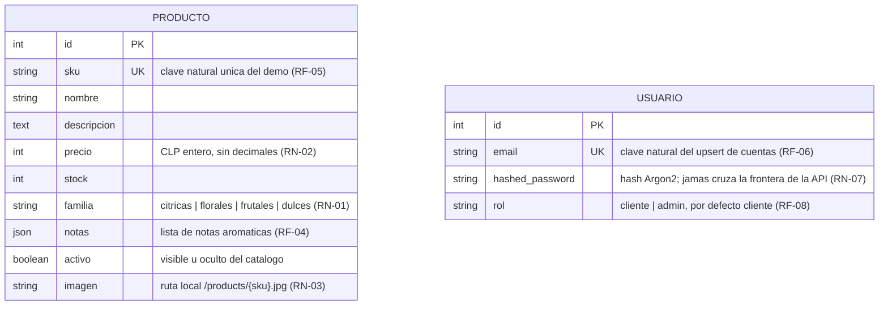
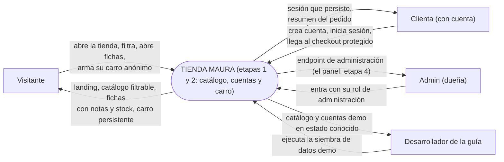
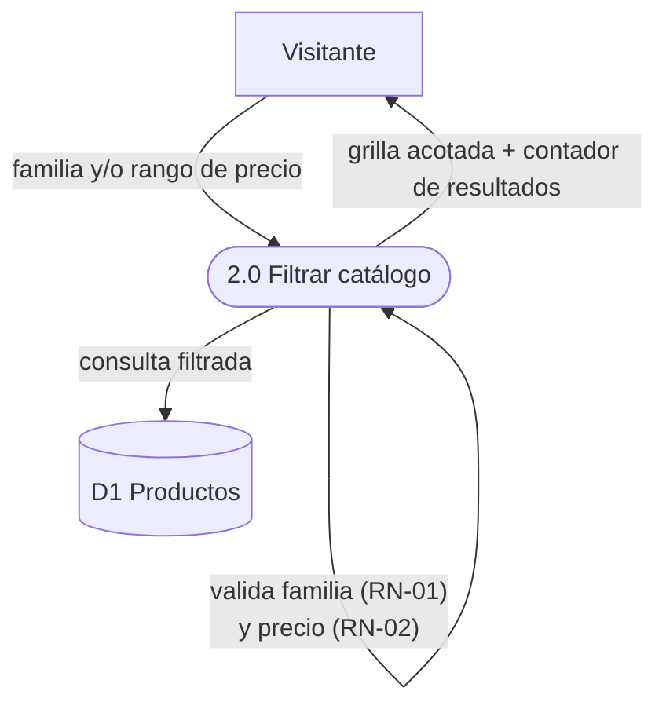
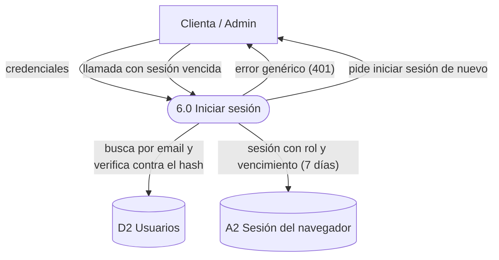

# Fase 3 — Diseño del Sistema: Maura

> **Guía:** Demo Carro — ciclo de vida del software en una tienda de body splash (segunda guía de la serie, hermana de demo-cine)
> **Fase del ciclo de vida:** 3. Diseño
> **Insumo obligatorio:** `02_requerimientos.md` — cada elemento de este diseño **nace de un requerimiento** (RF/RNF/RN/HU) y la trazabilidad está en §5.
> **Alcance de la fase:** se diseña QUÉ estructuras, procesos y pantallas resuelven los requerimientos, **aún sin elegir tecnología** (framework, base de datos específica, etc. — eso es la fase 4).
> **Fecha:** 2026-09-28

> **Nota técnica:** los diagramas están escritos en **Mermaid** para renderizarlos
> en cualquier visor (GitHub incluido). Alumnos: un diagrama que no se puede
> redibujar es un diagrama muerto.

---

## 1. Qué diseña este documento

| Sección | Diseña | Responde a |
|---|---|---|
| §2 | Los **datos** (modelo relacional + diccionario) | RF-02, RF-04, RF-05, RF-06, RF-08, RN-01, RN-02, RN-03, RN-05..RN-09, RNF-04 |
| §3 | Los **procesos** (diagrama de contexto + DFD) | HU-01…HU-08, procesos de `02_requerimientos.md` §9 |
| §4 | La **interfaz** (7 pantallas, wireframes) | RF-01…RF-04, RF-06…RF-11, RNF-01, C3 (celular primero) |

Se diseña QUÉ: la tecnología con la que se construye — y las alternativas
descartadas — se decide y documenta en la fase 4 (`04_arquitectura/`, con ADRs).

---

## 2. Diseño de datos

### 2.1 Diagrama entidad-relación



**Lectura del diagrama:** la etapa 1 tenía una sola entidad (PRODUCTO); la
etapa 2 suma **USUARIO**, todavía sin relaciones entre ambas — nada del carro
vive en la base de datos: el carro es del navegador (almacén A2, §3.2). Los
pedidos siguen reservados para la etapa 3 y serán quienes conecten USUARIO con
PRODUCTO por relaciones nuevas (una clienta hace pedidos; un pedido elige
productos). Diseñar solo lo que cada etapa necesita evita inventar tablas que
todavía nadie pide — pero los campos clave (`id`, `sku`, `activo`, `email`) ya
se eligen pensando en ese futuro cercano.

### 2.2 Diccionario de datos

**Entidad PRODUCTO** (soporta RF-02, RF-04, RF-05, RN-01, RN-02, RN-03)

| Atributo | Tipo | Longitud | Obligatorio | Restricción / origen |
|---|---|---|---|---|
| id | Entero | — | Sí | Identificador (clave primaria) |
| sku | Texto | 20 | Sí | **Único**; clave natural estable del catálogo demo: la siembra idempotente actualiza por sku sin duplicar (RF-05) |
| nombre | Texto | 120 | Sí | No vacío; se muestra en tarjeta y ficha (RF-02, RF-04) |
| descripcion | Texto largo | 1000 | Sí | Texto libre, solo se muestra en la ficha (RF-04) |
| precio | Entero | — | Sí | CLP **sin decimales**, dentro de $6.990–$12.990 en el catálogo demo (RN-02) |
| stock | Entero | — | Sí | Unidades disponibles; 0 → "Agotado" (RF-04, CS2) |
| familia | Lista cerrada | 20 | Sí | Uno de `citricas`, `florales`, `frutales`, `dulces` — sin acentos en el intercambio de datos (RN-01) |
| notas | Lista de textos | — | Sí | Notas aromáticas como lista (p. ej. "rosa", "geranio", "litchi"), mostradas como fichas individuales (RF-04) |
| activo | Sí/No | — | Sí | Un producto inactivo no aparece en catálogo ni ficha: se oculta sin borrarlo (futura etapa 4) |
| imagen | Texto | 200 | Sí | Ruta local `/products/{sku}.jpg`; la foto vive como archivo del proyecto, no como dato (RN-03) |

**Entidad USUARIO** (soporta RF-06, RF-07, RF-08, RN-05, RN-06, RN-07)

| Atributo | Tipo | Longitud | Obligatorio | Restricción / origen |
|---|---|---|---|---|
| id | Entero | — | Sí | Identificador (clave primaria) |
| email | Texto | 255 | Sí | **Único**, con índice de búsqueda; clave natural de las cuentas: la siembra de credenciales demo de la etapa 2 actualiza por email sin duplicar, igual que el catálogo por sku (RF-06, D-23/D-24) |
| hashed_password | Texto | 255 | Sí | Hash de la contraseña con Argon2 (prefijo reconocible `$argon2id$…`); **jamás cruza la frontera de la API**: ninguna respuesta del sistema lo incluye (RN-07, RNF-05) |
| rol | Lista cerrada | — | Sí | Uno de `cliente` o `admin`; por defecto `cliente` al registrarse; el rol viaja en la sesión desde el primer inicio (RF-08) |

### 2.3 Decisiones de diseño de datos (y por qué)

1. **El precio es un entero en pesos, sin decimales.** El peso chileno no usa
   centavos en la práctica diaria; guardar decimales invita a errores de
   redondeo que en plata se pagan. El formato con punto de miles
   ("$7.990") es un asunto de **presentación**, no del dato.
2. **La familia viaja sin acentos y se muestra con acento.** El sistema guarda
   y filtra por `citricas` (sin tilde); la pantalla muestra "Cítricas". Razón:
   el filtro de familia viaja en la **dirección** de la página del catálogo
   (una página por familia se puede guardar, compartir y recargar), y las
   direcciones con acentos y signos exóticos se corrompen fácil. Se guarda el
   valor limpio y la pantalla traduce.
3. **Las notas aromáticas son una lista, no un párrafo.** La ficha las muestra
   como fichas sueltas una al lado de la otra ("rosa" · "geranio" · "litchi").
   Si fueran texto plano, la pantalla tendría que adivinar dónde termina una
   nota y empieza la siguiente.
4. **La imagen NO es un dato del catálogo: es un archivo y una ruta.** La tabla
   guarda `/products/{sku}.jpg` — dónde encontrar la foto — y la foto vive como
   archivo del propio proyecto. Una foto en la base de datos la inflaría sin
   necesidad: las fotos no se filtran ni se ordenan, solo se muestran. Además,
   depender de fotos hospedadas en servicios externos rompería la tienda si el
   servicio cambia o cae (RN-03).
5. **`activo` permite ocultar sin borrar.** Desactivar un producto lo saca del
   catálogo sin destruir su historial — cuando lleguen pedidos (etapa 3), un
   pedido viejo no puede quedar apuntando a un producto borrado. Ocultar es
   reversible; borrar no.
6. **`sku` único desde el día uno.** Es la llave natural estable del catálogo
   demo: la siembra idempotente (RF-05) la usa para decidir "¿creo o actualizo?"
   sin duplicar jamás, y los archivos de imagen se nombran por sku
   (`/products/citricas-01.jpg`), así producto y foto quedan emparejados por
   construcción.
7. **El email es la llave de las cuentas (y de la siembra de credenciales).**
   Misma lección del sku aplicada a USUARIO: el email es una llave de negocio
   — único, estable y significativo para la clienta — mientras el `id` es una
   llave técnica. La siembra de las cuentas demo (la dueña y una clienta de
   prueba) decide "¿creo o actualizo?" por email, y re-ejecutarla restaura las
   credenciales demo sin duplicar usuarios (D-23/D-24).
8. **La contraseña se guarda solo como hash — y el hash jamás sale del
   sistema.** El proceso 5.0 recibe la contraseña una vez, la transforma con
   Argon2 (un hash lento a propósito: adivinarlo por fuerza bruta es caro) y
   guarda solo el resultado. Ninguna respuesta de la API incluye el hash
   (RN-07): filtrarlo sería regalar el equivalente de la contraseña de cada
   clienta.
9. **El carro guarda solo identificadores y cantidades; el precio se consulta
   siempre al catálogo.** El carro vive en el navegador (almacén A2) sin
   precios ni nombres: la pantalla del carro hidrata cada línea contra el
   catálogo vigente (D-27, RN-08). Un precio guardado sería un precio viejo
   esperando el momento de engañar a la clienta cuando Maura actualice el
   catálogo — y la lección prepara la etapa 3, donde el backend recalculará el
   pedido completo sin confiar en lo que el navegador mande.
10. **Las cantidades visibles se tapan al stock.** La ficha deshabilita
   "Agregar al carro" cuando no hay (o no queda) stock, y el carro ajusta la
   cantidad guardada si el stock bajó mientras el aroma esperaba (D-30,
   RN-09). Es una barrera de honestidad en pantalla, no la muralla: la
   validación definitiva la hará el backend al crear la orden (etapa 3).

> **Pregunta para la clase:** ¿por qué no usar el `id` (número correlativo)
> como llave de la siembra en lugar del sku? (pista: qué pasa con los números
> si alguien borra filas de una tabla copiada a otra máquina). Esa es la
> diferencia entre una llave técnica y una llave de negocio.

> **Pregunta para la clase (etapa 2):** ¿qué ganaría la tienda guardando el
> carro en la base de datos del servidor en vez del navegador? (pista: ¿qué
> necesita un visitante para tener carro en el servidor, y en qué momento lo
> consigue?). El diseño elige el navegador: el visitante anónimo puede armar
> su carro desde el primer clic (RF-11).

---

## 3. Diseño de procesos (DFD)

### 3.1 Diagrama de contexto

El sistema como un único proceso, con sus entidades externas (la etapa 2 suma
a la clienta identificada y a la dueña con rol de administración):



### 3.2 Almacenes de datos

| # | Almacén | Contenido | Equivale a |
|---|---|---|---|
| D1 | Productos | El catálogo (12 aromas demo) | Entidad PRODUCTO |
| D2 | Usuarios | Las cuentas: clientas y la dueña (email único, hash de contraseña, rol) | Entidad USUARIO |
| A1 | Imágenes de producto | Fotos guardadas como archivos del proyecto (§2.3.4) | — |
| A2 | localStorage del navegador | La sesión iniciada y el carro del cliente, guardados en el propio navegador | — |

> El almacén A2 es una **decisión de diseño, no de tecnología**: lo que aquí
> se decide es que el estado de sesión y el carro viven en el navegador del
> cliente (RNF-06) — el mecanismo concreto (localStorage) se elige y documenta
> en la fase 4. Por eso el carro no aparece en el modelo de datos de §2: la
> base de datos del sistema no guarda ningún carro en esta etapa.

### 3.3 DFD — Proceso 1.0: Explorar el catálogo (HU-01)


**Reglas del proceso:** solo productos **activos** aparecen (§2.3.5); el
orden de la grilla es estable para que la tienda no "baile" entre recargas;
no se exige cuenta para nada de esto (RNF-03).

### 3.4 DFD — Proceso 2.0: Filtrar el catálogo (HU-02)



**Reglas del proceso:** una familia fuera de la lista cerrada se rechaza con
un mensaje claro (RN-01); precios fuera de rango también (RN-02); si el
resultado es cero, la pantalla lo explica y ofrece limpiar los filtros
(HU-02). El estado del filtro queda escrito en la dirección de la página:
recargar o compartir la dirección mantiene el mismo resultado.

### 3.5 DFD — Proceso 3.0: Ver la ficha de un producto (HU-03)


**Reglas del proceso:** la ficha muestra **siempre** notas y disponibilidad
(CS2); un producto inactivo se trata como inexistente (§2.3.5); el regreso al
catálogo conserva los filtros que el visitante tenía.

### 3.6 DFD — Proceso 4.0 (interno): Sembrar datos demo (HU-04)


**Reglas del proceso:** la siembra **nunca borra** el catálogo para
rellenarlo: por cada producto decide crear o actualizar según el sku (RF-05,
§2.3.6). Re-ejecutarla es seguro y deja el catálogo idéntico (CS3, RNF-04) —
incluida la restauración de los valores demo de precio y stock tras una
prueba que los haya movido.

### 3.7 DFD — Proceso 5.0: Crear cuenta (HU-05)


**Reglas del proceso:** la contraseña cumple el mínimo de 8 caracteres sin
composición obligatoria (RN-05); con un email ya registrado la respuesta es
clara e invita a iniciar sesión (409, RN-06); la contraseña se guarda solo
como hash (RN-07); y crear la cuenta **no** inicia sesión — la clienta pasa
al login (proceso 6.0) con un aviso de éxito.

### 3.8 DFD — Proceso 6.0: Iniciar sesión (HU-06)



**Reglas del proceso:** las credenciales incorrectas producen siempre el
mismo error genérico, sin revelar si el email existe (401, RN-06); la sesión
nace con el rol de la cuenta — desde el primer inicio, para que la
administración pueda exigirlo (RF-08) — y vence a los 7 días (D-20); vencida
la sesión, cualquier llamada protegida rechaza y la clienta vuelve a entrar;
la sesión guardada en A2 sobrevive recargas y cierres del navegador (RF-07,
RNF-06).

### 3.9 DFD — Proceso 7.0: Armar y editar el carro (HU-07)


**Reglas del proceso:** el carro guarda únicamente identificadores y
cantidades — el nombre y el precio de cada línea se hidratan siempre contra
el catálogo vigente (RN-08, D-27); la cantidad mostrada se tapa al stock
vigente y el control "+" no pasa de ahí (RN-09, D-30); vaciar exige
confirmación en dos pasos; un aroma que ya no existe degrada su fila sin
romper el resto del carro.

### 3.10 DFD — Proceso 8.0: Ver checkout protegido (HU-08)


**Reglas del proceso:** la sesión iniciada es requisito para ver el resumen
(RF-09); el login recuerda el destino original y devuelve a la clienta
exactamente a donde iba (D-32); las líneas se hidratan con precios vigentes
igual que en el carro (RN-08); y la acción de pago nace deshabilitada con su
nota a la vista — el pago llega en la etapa siguiente (D-31).

---

## 4. Diseño de interfaz (pantallas)

### 4.1 Lineamientos generales

- **Tema visual:** fresco y luminoso — mucho blanco, pasteles cítricos,
  tipografía redondeada. El mensaje visual del producto es "esta tienda huele
  a frescura". (Deliberadamente distinto del tema oscuro tipo sala de cine
  del proyecto hermano demo-cine: el diseño sirve a la marca, no al revés.)
- **Celular primero** (C3, RNF-01): la grilla se reordena de 4 a 2 y a 1
  columna según el ancho; los filtros se acomodan en varias líneas; ningún
  control exige pantalla ancha y todo lo táctil mide al menos 44 px.
- **La dirección de la página es estado:** los filtros elegidos quedan escritos
  en la dirección (etapa del proceso 2.0) — recargar, retroceder o compartir
  la dirección mantiene lo que el visitante estaba viendo.
- **Estados obligatorios por pantalla:** cada pantalla declara sus estados de
  carga, error y vacío. Ninguna pantalla se diseña solo para el caso feliz.

### 4.2 Pantalla 1 — Inicio (landing)

**Origen:** RF-01, HU-01 (con la página del catálogo) · **Estados:** normal
(contenido de marca estático; sin datos que cargar, no tiene estados de
carga ni error propios)

```
┌────────────────────────────────────────────────────────┐
│  Maura · Body Splash              Inicio    Catálogo   │
├────────────────────────────────────────────────────────┤
│                                                        │
│                    Maura · Body Splash                 │
│               Frescura que te acompaña                 │
│                                                        │
│     Soy Maura. Hago body splash a mano, en lotes       │
│     pequeños, con esencias frescas que elijo una       │
│     por una. Esta tienda nace para que encuentres      │
│     tu aroma desde cualquier parte de Chile, sin       │
│     intermediarios.                                    │
│                                                        │
│                  ( Ver catálogo )                      │
│                                                        │
├────────────────────────────────────────────────────────┤
│  Nuestras familias                                     │
│  ┌──────────┐ ┌──────────┐ ┌──────────┐ ┌──────────┐  │
│  │ Cítricas │ │ Florales │ │ Frutales │ │  Dulces  │  │
│  │ Frescas  │ │ Suaves y │ │ Dulces y │ │ Cálidas  │  │
│  │ y chis-  │ │ románti- │ │ jugosas, │ │ y recon- │  │
│  │ peantes, │ │ cas, de  │ │ puro     │ │ fortantes│  │
│  │ para     │ │ flor a   │ │ verano.  │ │ , con    │  │
│  │ despertar│ │ flor.    │ │          │ │ alma de  │  │
│  │ Ver aromas→ Ver aromas→ Ver aromas→  repostería.  │  │
│  │                                    Ver aromas→   │  │
│  └──────────┘ └──────────┘ └──────────┘ └──────────┘  │
├────────────────────────────────────────────────────────┤
│  Maura · Body Splash — proyecto educativo · 2026       │
└────────────────────────────────────────────────────────┘
```

- La acción "Ver aromas →" de cada familia lleva al catálogo **ya filtrado**
  por esa familia (puerta lateral al proceso 2.0, HU-02).
- La frase de la marca ("Frescura que te acompaña") es el texto más grande de
  toda la tienda: la avenida de entrada.

### 4.3 Pantalla 2 — Catálogo con filtros

**Origen:** RF-02, RF-03, HU-01, HU-02 · **Estados:** carga (esqueletos de
tarjetas mientras llegan los datos) / error (mensaje con botón Reintentar) /
vacío con filtros ("No encontramos aromas con esos filtros" + Limpiar
filtros) / vacío sin datos ("Aún no hay aromas por aquí" + pista de siembra)

```
┌────────────────────────────────────────────────────────┐
│  Maura · Body Splash              Inicio    Catálogo   │
├────────────────────────────────────────────────────────┤
│  ┌──────────────────────────────────────────────────┐  │
│  │ Familia:                                          │  │
│  │  (Todas) (Cítricas) (Florales) (Frutales) (Dulces)│  │
│  │ Precio:   [$ mínimo]  [$ máximo]   (Filtrar)      │  │
│  │           Limpiar filtros                         │  │
│  └──────────────────────────────────────────────────┘  │
│                                                        │
│  Nuestros aromas — 12 aromas                           │
│  ┌─────────┐  ┌─────────┐  ┌─────────┐  ┌─────────┐   │
│  │ [foto]  │  │ [foto]  │  │ [foto]  │  │ [foto]  │    │
│  │ Cítricas│  │ Cítricas│  │ Florales│  │ Dulces  │    │
│  │ Brisa de│  │ Limón y │  │ Jazmín  │  │ Vainilla│    │
│  │ Naranja │  │ Albahaca│  │ de Tarde│  │ y Sándalo│   │
│  │ $7.990  │  │ $6.990  │  │ $9.990  │  │ $12.990 │    │
│  └─────────┘  └─────────┘  └─────────┘  └─────────┘   │
│          … (8 tarjetas más: 12 en total)               │
└────────────────────────────────────────────────────────┘
```

- Cada tarjeta es un enlace a la ficha; la foto es cuadrada para que la grilla
  nunca se deforme, y el nombre se corta a dos líneas máximo.
- El contador ("12 aromas" / "1 aroma" / "0 aromas") dice siempre cuánto hay
  a la vista — filtrar a cero tiene que ser evidente, no un misterio.
- El estado de carga muestra tarjetas esqueleto del mismo tamaño que las
  reales: la página no "salta" cuando llegan los datos.
- El estado vacío se distingue por causa: con filtros activos se ofrece
  limpiarlos; sin filtros se sugiere ejecutar la siembra (proceso 4.0).

### 4.4 Pantalla 3 — Ficha de producto

**Origen:** RF-04, HU-03 · **Estados:** carga (esqueleto de imagen + líneas) /
error (mensaje con botón Reintentar) / no encontrado ("Producto no
encontrado" + Volver al catálogo, distinto del error de carga)

```
┌────────────────────────────────────────────────────────┐
│  ← Volver al catálogo                                  │
│                                                        │
│  ┌──────────────┐   [Florales] [¡Últimas 2 unidades!] │
│  │              │                                      │
│  │    [foto]    │   Rosa de Río                        │
│  │  (cuadrada,  │   $10.990                            │
│  │   grande)    │                                      │
│  │              │   Rosa con geranio y un guiño de     │
│  │              │   litchi. Floral con cuerpo, para    │
│  └──────────────┘   no pasar inadvertida.              │
│                                                        │
│                     Notas aromáticas                   │
│                  (rosa) (geranio) (litchi)             │
│                                                        │
│                     2 unidades disponibles             │
└────────────────────────────────────────────────────────┘
```

- Disponibilidad en tres formas: normal ("N unidades disponibles"), última
  ("¡Últimas N unidades!") y agotada ("Agotado") — el dato de stock (CS2)
  traducido a lenguaje de clienta.
- Las notas aromáticas se muestran como fichas sueltas (§2.3.3), una al lado
  de la otra.
- En celular las dos columnas se apilan: primero la foto, luego la
  información; nada se pierde.

**Variante de la etapa 2 — la ficha gana "Agregar al carro" (RF-10):**

```
│                     2 unidades disponibles             │
│                                                        │
│                ( Agregar al carro )                    │
```

- El botón vive **solo en la ficha** — donde ya hay stock a la vista y la
  clienta decidió qué aroma quiere; las tarjetas del catálogo siguen
  navegando a la ficha, igual que en la etapa 1 (D-29).
- Regla de deshabilitado por stock (RN-09): sin unidades disponibles el botón
  no se puede presionar (el estado "Agotado" ya lo comunica), y si el carro
  ya acumuló todo el stock del aroma, el botón se deshabilita con un aviso —
  la pantalla nunca promete más de lo que hay.
- Cada clic agrega una unidad (o incrementa la que ya estaba guardada);
  editar cantidades vive en el carro (pantalla 6).
- El feedback del clic es el contador del carro en la barra superior, que
  aumenta en vivo — sin avisos flotantes.

### 4.5 Pantalla 4 — Iniciar sesión (login)

**Origen:** RF-07, RF-09, HU-06 · **Estados:** sesión expirada (aviso ámbar
"Tu sesión expiró, ingresa de nuevo" — la sesión venció y el sistema pide
entrar de nuevo) / credenciales incorrectas (aviso rojo "Credenciales
incorrectas", sin revelar si el email existe — RN-06) / cuenta creada (aviso
esmeralda "Cuenta creada. Ingresa con tu email y contraseña.", al llegar del
registro) / enviando (botón deshabilitado mientras valida) / ya con sesión
(la pantalla no se muestra: redirige al inicio)

```
┌────────────────────────────────────────────────────────┐
│  Maura · Body Splash        Inicio   Catálogo   Carro  │
│                                              Ingresar  │
├────────────────────────────────────────────────────────┤
│        ┌────────────────────────────────────────┐      │
│        │ (aviso de contexto, solo si corresponde:│     │
│        │  sesión expirada · cuenta creada)       │     │
│        └────────────────────────────────────────┘      │
│                                                        │
│                   Iniciar sesión                       │
│        ┌────────────────────────────────────┐          │
│        │  Email                             │          │
│        │  [______________________________]  │          │
│        │  Contraseña                        │          │
│        │  [______________________________]  │          │
│        │                                    │          │
│        │  [       Iniciar sesión       ]    │          │
│        │                                    │          │
│        │  (aviso rojo: "Credenciales        │          │
│        │   incorrectas" — solo si falla)    │          │
│        └────────────────────────────────────┘          │
│                                                        │
│         ¿No tienes cuenta?  Crear cuenta               │
└────────────────────────────────────────────────────────┘
```

- Ambos campos usan etiquetas visibles (nada de textos que desaparecen al
  escribir): la clienta entra con lo que recuerda, no con pistas.
- **Retorno al destino (RF-09):** si la clienta llegó aquí porque una página
  protegida se lo pidió (p. ej. el checkout), al entrar vuelve exactamente a
  donde iba; si llegó por su cuenta, vuelve al inicio.
- Los avisos de contexto son mutuamente excluyentes y ocupan el mismo lugar:
  la pantalla explica por qué pide credenciales, nunca adivina.
- Con la sesión iniciada, la barra superior cambia "Ingresar" por el email de
  la clienta con la acción "Cerrar sesión".

### 4.6 Pantalla 5 — Crear cuenta (registro)

**Origen:** RF-06, HU-05, RN-05, RN-06 · **Estados:** validación en pantalla
("Escribe un email válido." / "La contraseña debe tener al menos 8
caracteres.") / email ya registrado (aviso rojo "Ese email ya tiene cuenta,
inicia sesión" — el 409 de RN-06) / creando (botón deshabilitado mientras
crea la cuenta)

```
┌────────────────────────────────────────────────────────┐
│  Maura · Body Splash        Inicio   Catálogo   Carro  │
│                                              Ingresar  │
├────────────────────────────────────────────────────────┤
│                   Crear cuenta                         │
│        ┌────────────────────────────────────┐          │
│        │  Email                             │          │
│        │  [______________________________]  │          │
│        │  Contraseña                        │          │
│        │  [______________________________]  │          │
│        │  Mínimo 8 caracteres.              │          │
│        │                                    │          │
│        │  [        Crear cuenta        ]    │          │
│        │                                    │          │
│        │  (aviso rojo: "Ese email ya        │          │
│        │   tiene cuenta, inicia sesión"     │          │
│        │   — solo si el email existe)       │          │
│        └────────────────────────────────────┘          │
│                                                        │
│         ¿Ya tienes cuenta?  Iniciar sesión             │
└────────────────────────────────────────────────────────┘
```

- La ayuda "Mínimo 8 caracteres." acompaña al campo desde el primer render:
  la regla RN-05 se ve antes de equivocarse, no después.
- La validación de la pantalla espeja la de la API (mismo mínimo, mismo
  formato de email): la pantalla da la respuesta inmediata, la API sigue
  siendo la autoridad.
- Crear la cuenta **no** inicia sesión (todavía no hay sesión): al terminar,
  el sistema lleva al login con el aviso esmeralda de "Cuenta creada" — la
  clienta confirma su contraseña entrando.
- La asimetría de los avisos es deliberada (RN-06): aquí el sistema dice con
  claridad cuándo el email ya existe; en el login jamás lo revela.

### 4.7 Pantalla 6 — Carro

**Origen:** RF-10, RF-11, HU-07, RN-08, RN-09 · **Estados:** carga (filas
esqueleto mientras llegan los precios vigentes) / error de carga (mensaje con
la causa y botón Reintentar) / ítem no disponible (fila degradada "Este aroma
ya no está disponible" + Quitar) / vacío ("Tu carro está vacío" + botón Ver
catálogo que reemplaza toda la página)

```
┌────────────────────────────────────────────────────────┐
│  Maura · Body Splash    Inicio  Catálogo  Carro (3)    │
│                                             Ingresar   │
├────────────────────────────────────────────────────────┤
│  Tu carro                                               │
│  ┌──────────────────────────────────────────────────┐  │
│  │ [foto] Cítricas                                  │  │
│  │         Brisa de Naranja        (−) 2 (+)        │  │
│  │         $7.990 c/u               Quitar          │  │
│  │                                  $15.980         │  │
│  ├──────────────────────────────────────────────────┤  │
│  │ [foto] Florales                                  │  │
│  │         Rosa de Río              (−) 1 (+)       │  │
│  │         $10.990 c/u              Quitar          │  │
│  │                                  $10.990         │  │
│  │                                                  │  │
│  │  Vaciar carro  →  "¿Vaciar todo el carro?"       │  │
│  │                   [ Sí, vaciar ] [ Cancelar ]    │  │
│  └──────────────────────────────────────────────────┘  │
│                ┌────────────────────────┐              │
│                │ Total          $26.980 │              │
│                │ [  Finalizar compra  ] │              │
│                └────────────────────────┘              │
└────────────────────────────────────────────────────────┘
```

- Cada fila hidrata foto, nombre y **precio vigente** consultando el catálogo
  (RN-08): el carro propio solo guarda qué aromas y cuántas unidades — el
  precio nunca se guardó, así que nunca está viejo.
- El stepper "−/+" edita la cantidad: "+" se tapa al stock vigente (RN-09) y
  la cantidad guardada se ajusta sola si el stock bajó mientras el aroma
  esperaba en el carro.
- "Quitar" saca un aroma sin confirmación (impacto bajo); "Vaciar carro"
  pide confirmación **en dos pasos** en la misma zona — es la primera acción
  destructiva del sistema y se confirma sin diálogos del navegador.
- Un aroma que ya no está en el catálogo degrada su fila: sin stepper, con
  "Este aroma ya no está disponible" y la acción Quitar — el resto del carro
  sigue operando.
- El panel de resumen totaliza las líneas (sin envío: la logística está fuera
  de alcance) y concentra el CTA "Finalizar compra" hacia el checkout
  (pantalla 7).
- El contador "(3)" de la barra superior — unidades totales, oculto en cero —
  es el feedback vivo de cada "Agregar al carro" y la señal de que el carro
  acompaña a la clienta por toda la tienda.

### 4.8 Pantalla 7 — Checkout (protegida)

**Origen:** RF-09, HU-08 · **Estados:** sin sesión (no se ve: redirige al
login guardando el destino) / carro vacío con sesión (redirige al carro — un
resumen sin líneas no existe) / carga (esqueletos de líneas) / error de carga
(mensaje con la causa y Reintentar)

```
┌────────────────────────────────────────────────────────┐
│  ← Volver al carro                                      │
│                                                         │
│  Resumen de tu pedido                                   │
│  Comprando como clienta@ejemplo.cl                      │
│                                                         │
│  ┌──────────────────────────────────────────────────┐  │
│  │ Brisa de Naranja                × 2      $15.980 │  │
│  │ Rosa de Río                     × 1      $10.990 │  │
│  │ ──────────────────────────────────────────────── │  │
│  │ Total                                    $26.980 │  │
│  │                                                  │  │
│  │ [    Pagar con Webpay    ]  (deshabilitado)      │  │
│  │  El pago llega en la etapa siguiente.            │  │
│  └──────────────────────────────────────────────────┘  │
└────────────────────────────────────────────────────────┘
```

- Pantalla protegida (RF-09): sin sesión no existe; el login recuerda que la
  clienta venía aquí y la devuelve tras entrar (D-32).
- El subtítulo "Comprando como {email}" pone a la vista por qué esta pantalla
  exige sesión: el pedido quedará asociado a esa cuenta (los pedidos mismos
  llegan en la etapa 3).
- Las líneas no tienen stepper: la sala de edición es el carro; el resumen
  solo muestra y totaliza — siempre con precios vigentes (RN-08).
- El botón de pago nace deshabilitado con su nota a la vista: la pantalla
  queda construida para que la etapa 3 solo agregue el pago con Webpay
  (D-31).

---

## 5. Trazabilidad: requerimiento → diseño

| Requerimiento | Dónde se resuelve en este diseño |
|---|---|
| RF-01 (landing con identidad de marca) | §4.1 lineamientos · §4.2 pantalla 1 |
| RF-02 (catálogo en grilla) | §2.1/§2.2 PRODUCTO · §3.3 proceso 1.0 · §4.3 pantalla 2 |
| RF-03 (filtros por familia y precio) | §2.2 dominio de `familia` y `precio` · §3.4 proceso 2.0 · §4.3 barra de filtros + contador |
| RF-04 (ficha completa con notas y stock) | §2.2 `notas`, `stock`, `descripcion` · §3.5 proceso 3.0 · §4.4 pantalla 3 (estados de disponibilidad) |
| RF-05 (siembra idempotente) | §2.2 `sku` único · §2.3.6 decisión sku · §3.6 proceso 4.0 |
| RN-01 (familia en lista cerrada sin acentos) | §2.2 dominio de `familia` · §2.3.2 decisión slugs · §3.4 validación |
| RN-02 (precio entero CLP) | §2.2 dominio de `precio` · §2.3.1 decisión entero |
| RN-03 (imagen local como ruta) | §2.2 `imagen` · §2.3.4 decisión ruta · almacén A1 |
| RN-04 (catálogo de solo lectura) | §3.3/§3.4/§3.5 procesos sin escritura; la única escritura es el proceso interno 4.0 |
| RNF-01 (usable en el celular) | §4.1 lineamientos + grillas reordenables de §4.3 |
| RNF-04 (datos reproducibles) | §3.6 proceso 4.0 (crear-o-actualizar por sku) |
| RF-06 (crear cuenta) | §2.1/§2.2 USUARIO con `email` único · §3.7 proceso 5.0 · §4.6 pantalla 5 |
| RF-07 (iniciar sesión; sesión persistente) | §3.8 proceso 6.0 · §4.5 pantalla 4 · almacén A2 (sesión) |
| RF-08 (endpoint de administración por rol) | §2.2 `rol` cliente/admin · §3.1 admin como entidad externa · §3.8 el rol viaja en la sesión desde el primer inicio |
| RF-09 (checkout con sesión y retorno) | §3.10 proceso 8.0 · §4.5 pantalla 4 (retorno del login) · §4.8 pantalla 7 |
| RF-10 (agregar, editar, vaciar el carro) | §3.9 proceso 7.0 · §4.4 variante "Agregar al carro" · §4.7 pantalla 6 |
| RF-11 (carro que persiste en el navegador) | §3.2 almacén A2 · §3.9 proceso 7.0 (solo ids y cantidades) |
| RN-05 (mínimo 8, sin composición) | §3.7 validación del proceso 5.0 · §4.6 pantalla 5 (ayuda visible bajo el campo) |
| RN-06 (401 genérico / 409 claro) | §3.7 regla del 409 · §3.8 regla del 401 genérico · §4.5/§4.6 avisos de error |
| RN-07 (el hash jamás cruza la frontera) | §2.1/§2.2 `hashed_password` · §3.7 (solo el hash se guarda; ninguna respuesta lo incluye) |
| RN-08 (carro con ids y cantidades; precio vigente) | §3.9 hidratación contra D1 · §3.2 almacén A2 · §4.7/§4.8 totales hidratados |
| RN-09 (cantidades tapadas al stock) | §3.9 regla del tope · §4.4 botón deshabilitado por stock · §4.7 pantalla 6 (tope del stepper) |
| RNF-05 (hash y secreto en el servidor) | §3.7/§3.8 procesos 5.0 y 6.0: credenciales y firma de la sesión viven del lado del sistema |
| RNF-06 (sesión y carro en el navegador) | §3.2 almacén A2 (el estado del cliente vive en el cliente) |
| C3 (celular y notebook) | §4.1 · §4.3 · §4.4 (apilado en celular) |

---

## 6. Aprobación de la fase

| Rol | Nombre | Decisión | Fecha |
|---|---|---|---|
| Diseñador / Analista | ______________ | ☐ Aprobado ☐ Con observaciones | 2026-09-__ |
| Cliente (valida pantallas y flujos) | Maura — Maura · Body Splash | ☐ Aprobado ☐ Con observaciones | 2026-09-__ |

> **Nota para la clase:** con este documento el QUÉ y el CÓMO-lógico quedan
> cerrados: datos, procesos y pantallas. La fase 4 (`04_arquitectura/`) elige
> la tecnología y registra las decisiones como ADRs: tienda dividida en dos
> piezas (una que se ve, una que sirve datos), proyecto único con ambas
> piezas, tipos estrictos en ambas puntas, y el contrato del intercambio de
> datos escrito antes del código. El diseño no cambia; la arquitectura es lo
> que cambia sin tocar el diseño.
